# Investment Case API Guide — Frontend Integration  
# راهنمای یکپارچه‌سازی فرانت‌اند — پرونده سرمایه‌گذاری

**Audience / مخاطب:** Frontend engineers building the production SPA (or extending the reference test panel).  
**Source of truth / منبع حقیقت:** `InvestmentCasesController`, `CaseStateManager`, `InvestmentCaseAppService`, and reference UI in `Frontend/js/portal.js`, `workflow-model.js`, `kanban.js`, `app.js`.

| Part | Language |
|------|----------|
| [Part I — فارسی](#part-i--فارسی) | Persian — full scenarios & tables |
| [Part II — English](#part-ii--english) | English — same structure |

---

# Part I — فارسی

## فهرست

1. [خلاصه برای فرانت](#1-خلاصه-برای-فرانت)
2. [معماری UI مرجع (همان چیزی که الان داریم)](#2-معماری-ui-مرجع)
3. [تنظیمات API و envelope](#3-تنظیمات-api-و-envelope)
4. [ورود، نقش‌ها، دسترسی](#4-ورود-نقش‌ها-دسترسی) (شامل Identity، نشست، Admin kick)
5. [نقشه گردش کار (وضعیت‌ها)](#5-نقشه-گردش-کار)
6. [سناریوی end-to-end (با پورتال)](#6-سناریوی-end-to-end)
7. [مرحله‌به‌مرحله: وضعیت → UI → API](#7-مرحله‌به‌مرحله-وضعیت--ui--api)
8. [جدول action پورتال → API](#8-جدول-action-پورتال--api)
9. [مدارک (presign / confirm)](#9-مدارک)
10. [کانبان، داشبورد، استثناها](#10-کانبان-داشبورد-استثناها)
11. [جداول مرجع enum](#11-جداول-مرجع-enum)
12. [فهرست API](#12-فهرست-api)
13. [چک‌لیست SPA](#13-چک‌لیست-spa)

---

## 1. خلاصه برای فرانت

### اصل طلایی

1. **وضعیت پرونده** را از `currentStatus` (عدد) بخوانید — نه فقط `currentPhase`.
2. **UI مرحله** را از `workflow-model.js` → `STEPS` / `getStepperSteps()` بسازید (همان stepper پورتال).
3. **دکمه‌های اقدام** فقط وقتی نقش JWT با «واحد» آن مرحله جور باشد فعال شوند (`canActOnCase` / فیلتر تب واحد).
4. بعد از هر **transition موفق** (معمولاً HTTP **202**): دوباره `GET /investmentcases/{id}` + کانبان را رفرش کنید.
5. **آپلود فایل** همیشه: `presign` → `PUT` به S3 **بدون Bearer** → `confirm`.

### پایه URL

| مورد | مقدار |
|------|--------|
| پرونده | `{baseUrl}/api/v1/investmentcases` |
| کاربر / OTP | `{baseUrl}/api/v1/identity/users` |
| شرکت | `{baseUrl}/api/v1/identity/companies` |
| داشبورد | `{baseUrl}/api/v1/dashboard` |
| هدر | `Authorization: Bearer {accessToken}` |

تست محلی: `Frontend/config.js` → `baseUrl` (پیش‌فرض `http://localhost:5081`)، `casesVersion: "1"`.

### فیلدهای کلیدی `GET /investmentcases/{id}`

| فیلد | کاربرد UI |
|------|-----------|
| `id` | مسیر همه APIهای فرعی |
| `caseNumber` | نمایش در هدر / کانبان |
| `currentStatus` | کدام کارت مرحله و کدام دکمه‌ها |
| `currentPhase` | گروه‌بندی فاز (درخواست / ارزش‌گذاری / …) |
| `dataEntry1` / `dataEntry2` | پر کردن فرم‌های readonly یا edit |
| `company` | متقاضی حقوقی |

---


```


| state | منبع API |
|-------|----------|
| `caseData` | `GET /investmentcases/{id}` |
| `history` | `GET /investmentcases/{id}/history` |
| `documents` | `GET /investmentcases/{id}/documents` |
| `documentsLatest` | `GET /investmentcases/{id}/documents/latest` ← چک‌لیست قبل از Submit |
| `documentVersionGroups` | `GET .../version-groups?scope=` (بسته به status/نقش) |
| `comments` | `GET /investmentcases/{id}/comments?includeInternal=true|false` |
| `payments` / `paymentsSummary` | `GET /investmentcases/{id}/payments` (فقط کاربر داخلی؛ عملاً status 15) |

**رویداد:** بعد از transition، `document.dispatchEvent(new CustomEvent("testpanel:case-changed"))` → کانبان رفرش.

### تب‌های «واحد» در پورتال (`WorkflowModel.UNITS`)

| unit id | نقش‌های مجاز (claim) |
|---------|----------------------|
| `applicant` | Applicant, Admin |
| `investment` | InvestmentExpert, Admin |
| `manager` | InvestmentManager, Admin |
| `legal` | LegalExpert, LegalManager, LegalUnit, Admin |
| `financial` | FinancialExpert, FinancialManager, FinancialUnit, Admin |
| `ceo` | CEO, Admin |

`Admin` در `canActOnCase` همیشه `true` است.

### `renderStageHost()` — منطق UI

- `currentStatus` را می‌گیرد.
- یک **کارت مرحله** با فیلدها + دکمه‌های `data-action="..."` می‌سازد.
- کلیک → `handleAction(action)` → `apiRequest` → `refreshCase()`.

---

## 3. تنظیمات API و envelope

### پاسخ استاندارد

```json
{
  "success": true,
  "message": "پیام فارسی",
  "status": 200,
  "data": { },
  "validationErrors": { "field": ["..."] }
}
```

در پورتال: `unwrap(body).payload` یا `unwrap(body)` بسته به endpoint.

| HTTP | معنی |
|------|------|
| 200 | خواندن |
| 201 | ایجاد پرونده |
| 202 | transition گردش کار |
| 400 | JSON / validation (مثلاً `paymentDate` غلط) |
| 403 | نقش یا permission |
| 404 | پرونده نیست |
| 409 | وضعیت اشتباه، مدرک کم، concurrency |

### بدنه‌های مشترک transition

```json
// SemanticTransitionRequest — approve / submit comment
{ "comment": "اختیاری", "internalComment": "فقط داخلی" }

// SemanticRevisionRequest
{ "message": "الزامی برای revision-request" }

// Submit بدون body هم OK — پورتال {} می‌فرستد
```

### پرداخت — `POST /payments`

```json
{
  "amount": 2000000000,
  "paymentDate": "2026-05-19",
  "transactionNumber": "TX-001",
  "method": 1,
  "status": 1,
  "notes": null,
  "receiptS3Key": "cases/.../10/file.pdf"
}
```

- `paymentDate`: **فقط** `YYYY-MM-DD` (در پورتال: `buildRecordPaymentPayload()` — اگر خالی باشد = امروز).
- `method`: 1=انتقال، 2=چک، 3=نقد، 4=سایر.
- `status`: 1=Pending، 2=Completed، 3=Cancelled، 4=Failed.

---

## 4. ورود، نقش‌ها، دسترسی

### سناریو A — متقاضی (اولین بار)

| گام | کاربر | API |
|-----|--------|-----|
| 1 | شماره موبایل | `POST /identity/users/send-otp` `{ "phoneNumber": "09..." }` |
| 2 | کد OTP | `POST /identity/users/verify-otp` → `accessToken` |
| 3 | شرکت | `GET /identity/companies/mine` سپس در صورت نیاز `POST /identity/companies` |
| 4 | پرونده جدید | `POST /investmentcases` `{ "applicantType": 2, "companyId": "guid" }` |
| 5 | پورتال | `setCurrentCaseId(id)` → تب Portal → status **1 Draft** |

### سناریو B — کارشناس / مدیر / حقوقی / مالی / CEO

| گام | API / UI |
|-----|----------|
| 1 | OTP با persona در `config.js` (`workflowPersonas`) |
| 2 | `GET /investmentcases/kanban/action-required` |
| 3 | کلیک کارت → همان `caseId` در پورتال |

**چند نقش در تست:** Auth → Saved Sessions → **Use** (`app.js`).

### نقش JWT

| claim | DB `User.Role` | واحد پورتال |
|-------|----------------|-------------|
| `Applicant` | 1 | applicant |
| `InvestmentExpert` | 10 | investment |
| `InvestmentManager` | 11 | manager |
| `CEO` | 12 | ceo |
| `LegalExpert` / `LegalManager` | 20 / 21 | legal |
| `FinancialExpert` / `FinancialManager` | 30 / 31 | financial |
| `Admin` | 100 | همه |

نام‌های قدیمی: `User`→`Applicant`, `LegalUnit`→`LegalExpert` (`UserRoleClaims.Normalize`).

### Policyهای API (Gateway)

| Policy | نقش‌ها |
|--------|--------|
| `ApplicantOnly` | Applicant + Admin |
| `InternalOnly` | همه داخلی + Admin |
| `InvestmentCases.CeoApprove` | CEO + Admin |
| `Dashboard.Ceo` | CEO + Admin |
| `Dashboard.Board` | CEO + InvestmentManager + Admin |
| `AdminOnly` | فقط `Admin` |

### Identity — OTP، نشست، کاربر، شرکت

پایه: **`{baseUrl}/api/v1/identity`**. کنترلرها: `UserController`, `CompaniesController`.

#### چند نشست همزمان

- هر بار **`POST /identity/users/verify-otp`** موفق = یک **نشست جدید** (`SessionId` جدید در JWT claim `sid` + ردیف در `UserSessions`).
- کاربر می‌تواند روی چند دستگاه/مرورگر هم‌زمان لاگین باشد.
- **حداکثر نشست فعال:** از تنظیم سرور `Session:MaxActiveSessions` (پیش‌فرض **۳** در `appsettings.json`). اگر با login چهارم از حد بگذرد، **قدیمی‌ترین** نشست (کم‌فعال‌ترین `LastActivityAt`) خودکار قطع می‌شود (`session_limit_exceeded`).
- فرانت باید بعد از **403/401** روی API محافظت‌شده، کاربر را به OTP هدایت کند (نشست revoke شده یا token منقضی).

#### Claimهای JWT (پس از `verify-otp` / `refresh-token`)

| Claim | معنی |
|-------|------|
| `nameid` | `User.Id` |
| `unique_name` / name | معمولاً شماره موبایل |
| `role` | یک نقش: `Applicant`, `InvestmentExpert`, `CEO`, `Admin`, … |
| `sid` | `SessionId` (Guid) — برای logout و revoke |
| `userData` | JSON اطلاعات تکمیلی (نام، …) |

هدر درخواست‌های بعدی: `Authorization: Bearer {accessToken}`.

#### پاسخ ورود (`LoginDto` در `data`)

```json
{
  "tokenModel": {
    "accessToken": "...",
    "accessTokenExpiration": "2026-05-20T12:00:00Z",
    "refreshToken": "...",
    "refreshTokenExpiration": "2026-06-03T12:00:00Z"
  },
  "user": {
    "id": "guid",
    "phoneNumber": "09...",
    "role": "Applicant",
    "roleNumber": 1,
    "isActive": true
  }
}
```

#### API — OTP و توکن (بدون ورود)

| متد | مسیر | Body | پاسخ `data` |
|-----|------|------|-------------|
| `POST` | `/identity/users/send-otp` | `{ "phoneNumber": "09..." }` | — (پیام موفق) |
| `POST` | `/identity/users/verify-otp` | `{ "phoneNumber", "otpCode" }` | `LoginDto` |
| `POST` | `/identity/users/refresh-token` | `{ "refreshToken" }` + هدر **`Authorization: Bearer {accessToken}`** (حتی منقضی) | `LoginDto` |
| `POST` | `/identity/users` | `CreateUserDto` (ثبت‌نام) | `UserDto` |

#### API — نشست و پروفایل (کاربر لاگین‌شده)

| متد | مسیر | کار |
|-----|------|-----|
| `POST` | `/identity/users/logout` | خروج از **نشست فعلی** (همان `sid` در JWT) |
| `GET` | `/identity/users/sessions` | لیست نشست‌های **فعال خودم** → آرایه `SessionDto` |
| `POST` | `/identity/users/sessions/revoke` | قطع یک نشست خودم: `{ "sessionId": "guid" }` |
| `POST` | `/identity/users/sessions/revoke-all` | قطع **همه** نشست‌های خودم |
| `GET` | `/identity/users/profile` | پروفایل کاربر جاری |
| `GET` | `/identity/users/{id}` | جزئیات یک کاربر (با JWT) |
| `GET` | `/identity/users?take=&skip=` | صفحه‌بندی کاربران |
| `PUT` | `/identity/users/{id}` | به‌روزرسانی — تغییر `role` فقط **Admin** |
| `DELETE` | `/identity/users/{id}` | حذف کاربر |

**`SessionDto` (هر آیتم در لیست نشست):**

| فیلد | توضیح |
|------|--------|
| `sessionId` | شناسه نشست — برای revoke |
| `userId` | مالک نشست |
| `deviceId`, `userAgent`, `ipAddress` | متادیتای دستگاه |
| `createdAt`, `lastActivityAt` | زمان‌ها |
| `isActive` | `revokedAt == null` |

#### API — مدیریت نشست توسط Admin (`AdminOnly`)

فقط JWT با نقش **`Admin`**.

| متد | مسیر | کار |
|-----|------|-----|
| `GET` | `/identity/users/{userId}/sessions` | لیست نشست‌های فعال **آن کاربر** |
| `POST` | `/identity/users/{userId}/sessions/revoke-all` | **بیرون انداختن کامل** — قطع همه نشست‌ها + refresh tokenهای مرتبط + کش Redis |
| `POST` | `/identity/users/{userId}/sessions/revoke` | قطع یک نشست: `{ "sessionId": "guid" }` |

پیام موفق revoke-all ادمین: `نشست‌های کاربر توسط مدیر قطع شد.`

**رفتار فرانت پس از kick ادمین:** کاربر هدف در دستگاه‌هایش با refresh بعدی یا درخواست API → **401/403**؛ باید دوباره OTP بزند.

#### API — شرکت متقاضی (`/identity/companies`)

همه endpointها **`[Authorize]`** (هر نقش لاگین‌شده).

| متد | مسیر | کار |
|-----|------|-----|
| `GET` | `/identity/companies/mine` | شرکت‌های متعلق به کاربر جاری |
| `POST` | `/identity/companies` | ایجاد شرکت (`SaveCompanyRequest`) |
| `PUT` | `/identity/companies/{id}` | ویرایش شرکت |

قبل از `POST /investmentcases` برای متقاضی حقوقی معمولاً `companyId` از همین API لازم است.

#### نگهداری تنظیمات سرور (مرجع برای فرانت/اپراتور)

| کلید `appsettings` | پیش‌فرض | اثر |
|---------------------|---------|-----|
| `Session:MaxActiveSessions` | `3` | سقف نشست همزمان |
| `Session:AbsoluteExpirationDays` | `15` | انقضای نشست در Redis |
| `Session:RedisEnabled` | `true` (پروداکشن) | OTP/Session/Permission روی Redis |
| `Otp:DevBypassEnabled` | `false` (پروداکشن) | بدون bypass، OTP واقعی از SMS |

### Permission داخل سرویس (`CaseAuthorizationService`)

مثال: `cases:manage_payments`, `cases:ceo_approve`. **Admin:** `HasPermission` همیشه `true`.

---

## 5. نقشه گردش کار

```mermaid
stateDiagram-v2
  direction LR
  [*] --> Draft
  Draft --> DataEntry1: Applicant submit
  DataEntry1 --> ReviewDataEntry1: Applicant submit + PitchDeck
  ReviewDataEntry1 --> DataEntry2: Investment approve
  ReviewDataEntry1 --> DataEntry1: revision
  DataEntry2 --> ReviewDataEntry2: Applicant submit + docs
  ReviewDataEntry2 --> InitialValuation: Investment approve
  InitialValuation --> SecondaryValuation: Manager approve initial
  SecondaryValuation --> WaitingPreliminaryContract: Manager approve secondary
  WaitingPreliminaryContract --> WaitingUserReview: Legal upload PreContract
  WaitingUserReview --> ContractDrafting: Applicant approve
  ContractDrafting --> WaitingContractSignature: Legal finalize
  WaitingContractSignature --> WaitingSignedContractUpload: Legal confirm signature
  WaitingSignedContractUpload --> WaitingFinancialWorksheet: Legal upload Signed
  WaitingFinancialWorksheet --> FinancialWorksheetReview: Investment submit worksheet
  FinancialWorksheetReview --> WaitingCeoApproval: Financial approve
  WaitingCeoApproval --> WaitingPayment: CEO approve
  WaitingPayment --> Completed: Payments confirmed sum >= approved
```



**Happy path متنی:**

```text
متقاضی: ایجاد → DE1 + پیچ‌دک → ارسال
کارشناس سرمایه‌گذاری: بررسی DE1 → تأیید
متقاضی: DE2 + مدارک → ارسال
کارشناس: بررسی DE2 → تأیید
مدیر سرمایه‌گذاری: ارزش‌گذاری اولیه + ثانویه
حقوقی: پیش‌قرارداد → متقاضی تأیید → تدوین → امضا → قرارداد امضاشده
کارشناس: کاربرگ مالی → ارسال
مالی: تأیید کاربرگ
CEO: تأیید نهایی
مالی: اقساط پرداخت (ثبت + confirm) → Completed
```

---

## 6. سناریوی end-to-end

فرض: تیم QA از **همان پورتال** (`index.html`) تست می‌کند.

| # | نقش (session) | تب | کار در UI | APIهای اصلی |
|---|---------------|-----|-----------|-------------|
| 1 | Applicant | Cases | ایجاد پرونده | `POST /investmentcases` |
| 2 | Applicant | Portal | Draft: ذخیره DE1، آپلود type=1، Submit | `PUT .../data-entry1`, presign/confirm, `POST .../submit` |
| 3 | InvestmentExpert | Kanban → Portal | Review DE1: Approve | `POST .../data-entry1/approve` |
| 4 | Applicant | Portal | DE2: متن + ۷ مدرک اجباری، Submit | `PUT .../data-entry2`, `POST .../submit` |
| 5 | InvestmentExpert | Portal | Review DE2: Approve | `POST .../data-entry2/approve` |
| 6 | InvestmentManager | Portal | Valuation type=1، Approve initial؛ type=2، Approve secondary | `POST .../valuations`, `.../initial/approve`, `.../secondary/approve` |
| 7 | LegalExpert | Portal | آپلود PreContract (7) | presign → PUT → confirm → auto status 9 |
| 8 | Applicant | Portal | Approve pre-contract | `POST .../contracts/preliminary/approve` |
| 9 | LegalExpert | Portal | Finalize draft → Confirm signature → Upload Signed (9) | `finalize-draft`, `confirm-signature`, confirm |
| 10 | InvestmentExpert | Portal | Worksheet PUT + Submit | `PUT .../financial-worksheet`, `POST .../submit` |
| 11 | FinancialExpert | Portal | Approve worksheet | `POST .../financial-worksheet/approve` |
| 12 | CEO | Portal / Dashboard | Approve CEO | `POST .../ceo-approval/approve`, `GET /dashboard/ceo` |
| 13 | FinancialExpert | Portal | Record payment + Confirm | `POST .../payments`, `POST .../payments/{id}/confirm` |
| 14 | هر نقش | Portal | Completed — فقط مشاهده | `GET /investmentcases/{id}` |

**اتوماسیون:** `workflow-runner.js` همین ترتیب را با `config.workflowPersonas` اجرا می‌کند.

---

## 7. مرحله‌به‌مرحله: وضعیت → UI → API

در هر ردیف: **Status** | **مسئول** | **پورتال (`renderStageHost`)** | **APIها**

---

### 1 — `Draft` (1)

| | |
|--|--|
| **مسئول** | Applicant |
| **UI** | فیلد `de1Stage` (1=ایده، 2=نمونه اولیه)، `de1Amount`، آپلود اختیاری پیچ‌دک |
| **ذخیره** | `PUT /investmentcases/{id}/data-entry1` → `{ "businessStage": 1\|2, "requestedAmount": number }` |
| **ادامه** | `POST /investmentcases/{id}/data-entry1/submit` body `{}` |
| **بعد** | status **2** |

---

### 2 — `DataEntry1` (2)

| | |
|--|--|
| **مسئول** | Applicant |
| **شرط Submit** | `GET .../documents/latest` شامل **PitchDeck (type=1)** |
| **UI** | چک‌لیست مدارک DE1، دکمه «ارسال برای بررسی» |
| **API** | `PUT .../data-entry1` (اختیاری)، `POST .../data-entry1/submit` |
| **بعد** | status **3** — کارت در کانبان کارشناس |

---

### 3 — `ReviewDataEntry1` (3)

| | |
|--|--|
| **مسئول** | InvestmentExpert (+ Manager/Admin) |
| **UI** | خلاصه readonly، `approve-de1` / `revise-de1` |
| **تأیید** | `POST .../data-entry1/approve` → `{ "internalComment": "..." }` |
| **اصلاح** | `POST .../data-entry1/revision-request` → `{ "message": "الزامی" }` |
| **بعد** | تأیید → **4**؛ اصلاح → **2** |

**مدارک:** `version-groups?scope=data-entry` برای داخلی.

---

### 4 — `DataEntry2` (4)

| | |
|--|--|
| **مسئول** | Applicant |
| **UI** | `de2Basis` (متن)، جدول آپلود DE2 (`DATA_ENTRY_2_DOCUMENTS`) |
| **ذخیره** | `PUT .../data-entry2` → `{ "investmentAttractionBasis": "..." }` |
| **Submit** | پورتال `de2RequiredDocumentsComplete()` — types **12,13,14,3,15,4,19** |
| **API Submit** | `POST .../data-entry2/submit` |
| **بعد** | **5** |

---

### 5 — `ReviewDataEntry2` (5)

مثل مرحله 3 با prefix `de2`: `approve` / `revision-request` → بعد از تأیید **6**.

---

### 6 — `InitialValuation` (6)

| | |
|--|--|
| **مسئول** | InvestmentManager |
| **UI** | `record-valuation` سپس `approve-val-initial` |
| **ثبت** | `POST .../valuations` → `{ "type": 1, "amount": n, "notes": "..." }` |
| **تأیید** | `POST .../valuations/initial/approve` → `{ "comment": null }` OK |
| **بعد** | **7** |

---

### 7 — `SecondaryValuation` (7)

`POST .../valuations` با `"type": 2` → `POST .../valuations/secondary/approve` → **8**.

---

### 8 — `WaitingPreliminaryContract` (8)

| | |
|--|--|
| **مسئول** | LegalExpert |
| **UI** | آپلود فایل — **بدون دکمه submit جدا** |
| **API** | presign/confirm با `documentType: 7` (PreContract) |
| **بعد confirm** | معمولاً خودکار **9** |

Legacy: `POST .../contracts/preliminary/upload?s3Key=` اگر فایل از قبل در storage است.

---

### 9 — `WaitingUserReviewPreliminaryContract` (9)

| | |
|--|--|
| **مسئول** | Applicant |
| **UI** | تاریخچه نسخه‌های پیش‌قرارداد (`scope=preliminary`)، تأیید / اصلاح |
| **تأیید** | `POST .../contracts/preliminary/approve` `{}` |
| **اصلاح** | `POST .../contracts/preliminary/revision-request` `{ "message" }` → **8** |
| **نظر** | `POST .../comments` — `phase: 3`, `isInternal: false` |
| **بعد تأیید** | **10** |

---

### 10 — `ContractDrafting` (10)

Legal: اختیاری `FinalContract (8)` → `POST .../contracts/finalize-draft` → **11**.

---

### 11 — `WaitingContractSignature` (11)

`POST .../contracts/confirm-signature` → **12**.

---

### 12 — `WaitingSignedContractUpload` (12)

آپلود `SignedContract (9)` با presign/confirm → **13**.

---

### 13 — `WaitingFinancialWorksheet` (13)

| | |
|--|--|
| **مسئول** | InvestmentExpert |
| **ذخیره** | `PUT .../financial-worksheet` |
| **ارسال** | `POST .../financial-worksheet/submit` |
| **بدنه نمونه** | `{ "bankName", "iban", "approvedAmount", "paymentSchedule", "notes" }` |
| **بعد** | **14** |

---

### 14 — `FinancialWorksheetReview` (14)

FinancialExpert: `approve` / `revision-request` on worksheet → تأیید **20 (WaitingCeoApproval)**.

---

### 20 — `WaitingCeoApproval` (20)

| | |
|--|--|
| **مسئول** | CEO |
| **Policy** | `InvestmentCases.CeoApprove` |
| **تأیید** | `POST .../ceo-approval/approve` |
| **اصلاح** | `POST .../ceo-approval/revision-request` → برگشت به کاربرگ |
| **داشبورد** | `GET /dashboard/ceo` — `pendingCeoApprovals` |
| **بعد** | **15** |

---

### 15 — `WaitingPayment` (15)

| | |
|--|--|
| **مسئول** | FinancialExpert |
| **UI** | `renderPaymentsSection` + فرم قسط + confirm/cancel روی هر ردیف |
| **خواندن** | `GET .../payments` → `payments[]` + `summary` |
| **ثبت** | `POST .../payments` (بدنه §3) |
| **تأیید قسط** | `POST .../payments/{paymentId}/confirm` — بدنه خالی |
| **تکمیل** | وقتی `summary.totalConfirmed >= summary.approvedAmount` → **16** |

**رسید:** آپلود type **10** قبل از submit → `receiptS3Key` در body.

---

### 16 — `Completed` (16)

فقط مشاهده؛ کانبان «اقدام لازم» خالی.

---

### وضعیت‌های پایانی دیگر

| Status | API |
|--------|-----|
| 17 Rejected | `POST .../reject` `{ "reason" }` |
| 18 Cancelled | `POST .../cancel` |
| 19 Archived | `POST .../archive` |

---

## 8. جدول action پورتال → API

منبع: `portal.js` → `handleAction(action)`

| `data-action` | Method | Path |
|---------------|--------|------|
| `save-de1` | PUT | `/investmentcases/{id}/data-entry1` |
| `submit-de1` | POST | `/investmentcases/{id}/data-entry1/submit` |
| `approve-de1` | POST | `/investmentcases/{id}/data-entry1/approve` |
| `revise-de1` | POST | `/investmentcases/{id}/data-entry1/revision-request` |
| `save-de2` | PUT | `/investmentcases/{id}/data-entry2` |
| `submit-de2` | POST | `/investmentcases/{id}/data-entry2/submit` |
| `approve-de2` | POST | `/investmentcases/{id}/data-entry2/approve` |
| `revise-de2` | POST | `/investmentcases/{id}/data-entry2/revision-request` |
| `record-valuation` | POST | `/investmentcases/{id}/valuations` |
| `approve-val-initial` | POST | `/investmentcases/{id}/valuations/initial/approve` |
| `approve-val-secondary` | POST | `/investmentcases/{id}/valuations/secondary/approve` |
| `approve-pre-contract` | POST | `/investmentcases/{id}/contracts/preliminary/approve` |
| `revise-pre-contract` | POST | `/investmentcases/{id}/contracts/preliminary/revision-request` |
| `finalize-contract` | POST | `/investmentcases/{id}/contracts/finalize-draft` |
| `confirm-signature` | POST | `/investmentcases/{id}/contracts/confirm-signature` |
| `save-worksheet` | PUT | `/investmentcases/{id}/financial-worksheet` |
| `submit-worksheet` | POST | `/investmentcases/{id}/financial-worksheet/submit` |
| `approve-worksheet` | POST | `/investmentcases/{id}/financial-worksheet/approve` |
| `revise-worksheet` | POST | `/investmentcases/{id}/financial-worksheet/revision-request` |
| `approve-ceo` | POST | `/investmentcases/{id}/ceo-approval/approve` |
| `revise-ceo` | POST | `/investmentcases/{id}/ceo-approval/revision-request` |
| `record-payment` | POST | `/investmentcases/{id}/payments` |
| `confirm-payment` | POST | `/investmentcases/{id}/payments/{paymentId}/confirm` |
| `cancel-payment` | POST | `/investmentcases/{id}/payments/{paymentId}/cancel` |
| `post-comment` | POST | `/investmentcases/{id}/comments` |

**ایجاد پرونده** (تب Cases، `app.js`): `POST /investmentcases`

---

## 9. مدارک

### الگوی سه‌مرحله‌ای (`uploadDocument` در portal.js)

```text
1. POST /investmentcases/{id}/documents/presign     ← JWT
2. PUT  {url}                             ← بدون Authorization
3. POST /investmentcases/{id}/documents/confirm?s3Key=...  ← JWT، body خالی
```

**Presign body:**

```json
{
  "documentType": 1,
  "fileName": "pitch.pdf",
  "mimeType": "application/pdf",
  "fileSize": 1048576
}
```

### DE1 (متقاضی)

| type | نام | Submit DE1 |
|-----:|-----|:----------:|
| 1 | PitchDeck | **بله** |
| 11 | BusinessPlan | خیر |
| 99 | Other | خیر |

### DE2 — اجباری (پورتال)

12, 13, 14, 3, 15, 4, 19 — جزئیات برچسب در `workflow-model.js`.

### حقوقی / پرداخت

| type | نام | اثر confirm |
|-----:|-----|-------------|
| 7 | PreContract | 8 → 9 |
| 9 | SignedContract | 12 → 13 |
| 10 | PaymentReceipt | فقط metadata برای `receiptS3Key` |

### دانلود

- Stream: `GET .../documents/{documentId}/download`
- Presigned URL: همان مسیر با `?presign=true`

---

## 10. کانبان، داشبورد، استثناها

### کانبان

| بورد | API |
|------|-----|
| نیاز به اقدام | `GET /investmentcases/kanban/action-required` |
| در حال پیگیری | `GET /investmentcases/kanban/watching` |

کلیک کارت → `setCurrentCaseId` + `testpanel:case-changed`.

### داشبورد (`app.js` → `wireDashboard`)

| API | نقش |
|-----|-----|
| `GET /dashboard/ceo` | CEO, Admin |
| `GET /dashboard/board` | CEO, InvestmentManager, Admin |

### جستجو

`GET /investmentcases?caseNumber=&phase=&status=&page=&pageSize=`

---

## 11. جداول مرجع enum

### CaseStatus

| Value | Key | unit (stepper) |
|------:|-----|----------------|
| 1 | Draft | applicant |
| 2 | DataEntry1 | applicant |
| 3 | ReviewDataEntry1 | investment |
| 4 | DataEntry2 | applicant |
| 5 | ReviewDataEntry2 | investment |
| 6 | InitialValuation | manager |
| 7 | SecondaryValuation | manager |
| 8 | WaitingPreliminaryContract | legal |
| 9 | WaitingUserReviewPreliminaryContract | applicant |
| 10 | ContractDrafting | legal |
| 11 | WaitingContractSignature | legal |
| 12 | WaitingSignedContractUpload | legal |
| 13 | WaitingFinancialWorksheet | investment |
| 14 | FinancialWorksheetReview | financial |
| 20 | WaitingCeoApproval | ceo |
| 15 | WaitingPayment | financial |
| 16 | Completed | all |
| 17–19 | Rejected / Cancelled / Archived | all |

### CasePhase

| Value | عنوان |
|------:|-------|
| 1 | درخواست |
| 2 | ارزش‌گذاری |
| 3 | حقوقی |
| 4 | مالی |
| 5 | اختتام |

### Persona تست (`config.js`)

| key | role | phone (نمونه) |
|-----|------|----------------|
| applicant | 1 | 09100000002 |
| investmentExpert | 10 | 09100000003 |
| investmentManager | 11 | 09100000004 |
| legalExpert | 20 | 09100000005 |
| financialExpert | 30 | 09100000006 |
| ceo | 12 | 09100000007 |
| admin | 100 | 09100000001 |

---

## 12. فهرست API

پایه: **`/api/v1/investmentcases`**

| گروه | Endpoints |
|------|-----------|
| Kanban | `GET /kanban/action-required`, `/kanban/watching` |
| Core | `POST /`, `GET /`, `GET /{id}`, `GET /{id}/history` |
| DE1/DE2 | `PUT|POST .../data-entry1|2` (+ submit, approve, revision-request) |
| Valuation | `POST .../valuations`, `.../initial/approve`, `.../secondary/approve` |
| Contracts | preliminary approve/revision, finalize-draft, confirm-signature, legacy upload |
| Finance | worksheet PUT/submit/approve/revision, ceo-approval, payments |
| Documents | presign, upload, confirm, list, latest, version-groups, download |
| Comments | `GET|POST .../comments`, attachments |
| Evaluations | `GET|POST .../evaluations` |
| Negative | reject, cancel, archive |

### Identity — `/api/v1/identity`

**Users** (`/identity/users`):

| متد | مسیر | Auth |
|-----|------|------|
| `POST` | `/send-otp` | Anonymous |
| `POST` | `/verify-otp` | Anonymous → `LoginDto` |
| `POST` | `/refresh-token` | Anonymous + Bearer access |
| `POST` | `/` | Anonymous (ثبت‌نام) |
| `POST` | `/logout` | JWT |
| `GET` | `/sessions` | JWT (خودم) |
| `POST` | `/sessions/revoke` | JWT — body `{ sessionId }` |
| `POST` | `/sessions/revoke-all` | JWT |
| `GET` | `/profile` | JWT |
| `GET` | `/{userId}` | JWT |
| `GET` | `?take&skip` | JWT |
| `PUT` | `/{userId}` | JWT (تغییر role → Admin) |
| `DELETE` | `/{userId}` | JWT |
| `GET` | `/{userId}/sessions` | **AdminOnly** |
| `POST` | `/{userId}/sessions/revoke-all` | **AdminOnly** |
| `POST` | `/{userId}/sessions/revoke` | **AdminOnly** — body `{ sessionId }` |

**Companies** (`/identity/companies`):

| متد | مسیر | Auth |
|-----|------|------|
| `GET` | `/mine` | JWT |
| `POST` | `/` | JWT |
| `PUT` | `/{id}` | JWT |

---

## 13. چک‌لیست SPA

1. [ ] `WorkflowModel.normalizeRole` روی claim/login
2. [ ] صفحه داخلی: کانبان؛ متقاضی: لیست + ایجاد
3. [ ] Stepper از `getStepperSteps()` — نه hardcode ناقص
4. [ ] هر فایل: presign → PUT (بدون Bearer) → confirm
5. [ ] قبل از submit DE1/DE2: `GET documents/latest`
6. [ ] بعد از POST transition (202): refresh case + kanban event
7. [ ] قرارداد: بعد از confirm، status را دوباره بخوانید
8. [ ] پرداخت: `paymentDate` = `YYYY-MM-DD`
9. [ ] `includeInternal=true` فقط برای نقش داخلی
10. [ ] 403 → «نقش/session را عوض کنید»
11. [ ] Admin: همه policyها + `HasPermission` در سرویس
12. [ ] `refresh-token`: هدر Bearer + body `refreshToken`؛ بعد از login توکن‌ها را persist کنید
13. [ ] چند دستگاه: `GET /identity/users/sessions`؛ revoke یک دستگاه با `sessions/revoke`
14. [ ] پنل ادمین: kick کاربر با `POST .../users/{id}/sessions/revoke-all` (فقط Admin)
15. [ ] پس از kick یا login چهارم: کاربر باید دوباره OTP بزند (نشست قدیمی invalid)

---

# Part II — English

## Table of contents

1. [Frontend essentials](#1-frontend-essentials)
2. [Reference UI architecture](#2-reference-ui-architecture)
3. [API setup & envelope](#3-api-setup--envelope)
4. [Auth, roles, access](#4-auth-roles-access) (Identity, sessions, admin kick)
5. [Workflow map](#5-workflow-map)
6. [End-to-end scenario (portal)](#6-end-to-end-scenario-portal)
7. [Stage-by-stage: status → UI → API](#7-stage-by-stage-status--ui--api)
8. [Portal actions → API](#8-portal-actions--api)
9. [Documents](#9-documents)
10. [Kanban, dashboards, exceptions](#10-kanban-dashboards-exceptions)
11. [Reference enums](#11-reference-enums)
12. [API index](#12-api-index)
13. [SPA checklist](#13-spa-checklist)

---

## 1. Frontend essentials

### Golden rules

1. Drive UI from **`currentStatus`** (int), not only `currentPhase`.
2. Build the stepper from `workflow-model.js` → `STEPS` / `getStepperSteps()` (same as the portal).
3. Enable actions when the JWT role matches the step **unit** (`canActOnCase` / unit tabs).
4. After every successful **workflow transition** (usually HTTP **202**), reload `GET /investmentcases/{id}` and refresh kanban.
5. **File upload** is always: `presign` → `PUT` to storage **without Bearer** → `confirm`.

### Base URLs

| Resource | Path |
|----------|------|
| Cases | `{baseUrl}/api/v1/investmentcases` |
| Users / OTP | `{baseUrl}/api/v1/identity/users` |
| Companies | `{baseUrl}/api/v1/identity/companies` |
| Dashboard | `{baseUrl}/api/v1/dashboard` |
| Header | `Authorization: Bearer {accessToken}` |

Local test panel: `Frontend/config.js` → `baseUrl`, `casesVersion: "1"`.

### Key fields on `GET /investmentcases/{id}`

| Field | UI use |
|-------|--------|
| `id` | All sub-resource paths |
| `caseNumber` | Header / kanban card |
| `currentStatus` | Which stage card & buttons |
| `currentPhase` | Phase grouping |
| `dataEntry1` / `dataEntry2` | Forms |
| `company` | Legal applicant |

---

## 2. Reference UI architecture

This is the **in-repo reference frontend** — production SPA can mirror it.

```text
index.html
├── Auth tab       → app.js (OTP, multi-role sessions)
├── Cases tab      → app.js (create/search, caseId)
├── Portal tab     → portal.js ★ main stage UI
├── Kanban tab     → kanban.js
├── Dashboard tab  → app.js (CEO / Board)
└── workflow-runner.js → automated E2E
```

### `portal.js` state after `refreshCase()`

| State | API |
|-------|-----|
| `caseData` | `GET /investmentcases/{id}` |
| `history` | `GET /investmentcases/{id}/history` |
| `documents` | `GET /investmentcases/{id}/documents` |
| `documentsLatest` | `GET /investmentcases/{id}/documents/latest` |
| `documentVersionGroups` | `GET .../version-groups?scope=` |
| `comments` | `GET /investmentcases/{id}/comments?includeInternal=` |
| `payments` | `GET /investmentcases/{id}/payments` (internal users; status 15) |

Event: `testpanel:case-changed` refreshes kanban after transitions.

### Unit tabs (`WorkflowModel.UNITS`)

| unit | Roles |
|------|-------|
| applicant | Applicant, Admin |
| investment | InvestmentExpert, Admin |
| manager | InvestmentManager, Admin |
| legal | LegalExpert, LegalManager, LegalUnit, Admin |
| financial | FinancialExpert, FinancialManager, FinancialUnit, Admin |
| ceo | CEO, Admin |

`Admin` → `canActOnCase` is always true.

### `renderStageHost()`

Reads `currentStatus`, builds one **stage card** with `data-action` buttons → `handleAction()` → API → `refreshCase()`.

---

## 3. API setup & envelope

Standard wrapper: `success`, `message`, `status`, `data`, `validationErrors`.

Portal helper: `unwrap(body).payload`.

| HTTP | Meaning |
|------|---------|
| 200 | OK read |
| 201 | Case created |
| 202 | Workflow transition |
| 400 | Validation / bad JSON (e.g. invalid `paymentDate`) |
| 403 | Role / permission |
| 404 | Case not found |
| 409 | Wrong status, missing docs, concurrency |

### Common transition bodies

```json
{ "comment": "optional", "internalComment": "internal only" }
{ "message": "required for revision-request" }
```

### Record payment — `POST /payments`

```json
{
  "amount": 2000000000,
  "paymentDate": "2026-05-19",
  "transactionNumber": "TX-001",
  "method": 1,
  "status": 1,
  "notes": null,
  "receiptS3Key": "cases/.../10/file.pdf"
}
```

- `paymentDate`: **only** `YYYY-MM-DD` (portal: `buildRecordPaymentPayload()` defaults to today if empty).
- `method`: 1=BankTransfer, 2=Cheque, 3=Cash, 4=Other.
- `status`: 1=Pending, 2=Completed, 3=Cancelled, 4=Failed.

---

## 4. Auth, roles, access

### Scenario A — Applicant (first time)

| Step | API |
|------|-----|
| OTP send | `POST /identity/users/send-otp` |
| OTP verify | `POST /identity/users/verify-otp` → token |
| Company | `GET /identity/companies/mine`, then `POST` if needed |
| Create case | `POST /investmentcases` `{ "applicantType": 2, "companyId": "guid" }` |
| Portal | status **1 Draft** |

### Scenario B — Internal user

OTP with persona → `GET /investmentcases/kanban/action-required` → open case in portal.

Multi-role testing: Auth → Saved Sessions → **Use**.

### JWT roles

| Claim | DB role | Portal unit |
|-------|---------|-------------|
| Applicant | 1 | applicant |
| InvestmentExpert | 10 | investment |
| InvestmentManager | 11 | manager |
| CEO | 12 | ceo |
| LegalExpert / LegalManager | 20 / 21 | legal |
| FinancialExpert / FinancialManager | 30 / 31 | financial |
| Admin | 100 | all |

Legacy: `User`→`Applicant`, `LegalUnit`→`LegalExpert`.

### API policies

| Policy | Who |
|--------|-----|
| ApplicantOnly | Applicant + Admin |
| InternalOnly | All internal + Admin |
| InvestmentCases.CeoApprove | CEO + Admin |
| Dashboard.Ceo / Board | As in Program.cs |
| `AdminOnly` | `Admin` only |

### Identity — OTP, sessions, users, companies

Base: **`{baseUrl}/api/v1/identity`**. Controllers: `UserController`, `CompaniesController`.

#### Multiple concurrent sessions

- Each successful **`POST /identity/users/verify-otp`** creates a **new session** (new `SessionId` in JWT claim `sid` + DB row).
- Users may stay logged in on several devices/browsers at once.
- **Cap:** server setting `Session:MaxActiveSessions` (default **3** in `appsettings.json`). On a new login beyond the cap, the **oldest** active session (`LastActivityAt`) is revoked automatically.
- After **401/403** on protected APIs, route the user back to OTP (revoked session or expired token).

#### JWT claims (after verify / refresh)

| Claim | Meaning |
|-------|---------|
| `nameid` | `User.Id` |
| name | Usually mobile number |
| `role` | Single role string |
| `sid` | `SessionId` (Guid) |
| `userData` | Extra JSON profile payload |

Use `Authorization: Bearer {accessToken}` on subsequent calls.

#### Login response (`LoginDto` in `data`)

Same shape as [Persian Identity section](#identity--otp-نشست-کاربر-شرکت): `tokenModel` (access + refresh + expirations) and `user`.

#### APIs — OTP & tokens (anonymous)

| Method | Path | Body | `data` |
|--------|------|------|--------|
| `POST` | `/identity/users/send-otp` | `{ "phoneNumber" }` | — |
| `POST` | `/identity/users/verify-otp` | `{ "phoneNumber", "otpCode" }` | `LoginDto` |
| `POST` | `/identity/users/refresh-token` | `{ "refreshToken" }` + **`Authorization: Bearer {accessToken}`** | `LoginDto` |
| `POST` | `/identity/users` | `CreateUserDto` | `UserDto` |

#### APIs — sessions & profile (authenticated)

| Method | Path | Purpose |
|--------|------|---------|
| `POST` | `/identity/users/logout` | End **current** session (`sid` in JWT) |
| `GET` | `/identity/users/sessions` | List **my** active sessions → `SessionDto[]` |
| `POST` | `/identity/users/sessions/revoke` | Revoke one of mine: `{ "sessionId" }` |
| `POST` | `/identity/users/sessions/revoke-all` | Revoke **all** my sessions |
| `GET` | `/identity/users/profile` | Current user profile |
| `GET` | `/identity/users/{id}` | User by id |
| `GET` | `/identity/users?take&skip` | Paged users |
| `PUT` | `/identity/users/{id}` | Update user — **`role` change: Admin only** |
| `DELETE` | `/identity/users/{id}` | Delete user |

**`SessionDto`:** `sessionId`, `userId`, `deviceId`, `userAgent`, `ipAddress`, `createdAt`, `lastActivityAt`, `isActive`.

#### APIs — Admin session management (`AdminOnly`)

| Method | Path | Purpose |
|--------|------|---------|
| `GET` | `/identity/users/{userId}/sessions` | List target user's active sessions |
| `POST` | `/identity/users/{userId}/sessions/revoke-all` | **Force logout everywhere** for that user |
| `POST` | `/identity/users/{userId}/sessions/revoke` | Revoke one session: `{ "sessionId" }` |

Persian success message for admin revoke-all: user sessions terminated by admin.

#### APIs — Companies (`/identity/companies`)

All require JWT.

| Method | Path | Purpose |
|--------|------|---------|
| `GET` | `/identity/companies/mine` | Companies owned by current user |
| `POST` | `/identity/companies` | Create (`SaveCompanyRequest`) |
| `PUT` | `/identity/companies/{id}` | Update |

#### Server settings (ops reference)

| Key | Default | Effect |
|-----|---------|--------|
| `Session:MaxActiveSessions` | `3` | Concurrent session cap |
| `Session:AbsoluteExpirationDays` | `15` | Redis session TTL |
| `Session:RedisEnabled` | prod `true` | Distributed OTP/session cache |
| `Otp:DevBypassEnabled` | prod `false` | Real SMS OTP required |

**Admin:** `CaseAuthorizationService.HasPermission` always returns true.

---

## 5. Workflow map

See Mermaid diagram in [Persian section](#5-نقشه-گردش-کار) — same state machine.

**Happy path (text):**

Applicant create → DE1 + pitch deck → Investment review → DE2 + docs → Investment review → Manager valuations → Legal pre-contract → Applicant approve → Legal finalize/sign/upload → Investment worksheet → Financial review → CEO approve → Financial installments → **Completed**.

---

## 6. End-to-end scenario (portal)

| # | Role | Tab | UI | Main APIs |
|---|------|-----|-----|-----------|
| 1 | Applicant | Cases | Create case | `POST /investmentcases` |
| 2 | Applicant | Portal | Draft DE1 + upload type 1 + submit | `PUT .../data-entry1`, presign/confirm, submit |
| 3 | InvestmentExpert | Kanban | Approve DE1 | `POST .../data-entry1/approve` |
| 4 | Applicant | Portal | DE2 + required docs + submit | `PUT .../data-entry2`, submit |
| 5 | InvestmentExpert | Portal | Approve DE2 | approve DE2 |
| 6 | InvestmentManager | Portal | Valuations 1 & 2 | valuations + approve initial/secondary |
| 7 | LegalExpert | Portal | Upload PreContract (7) | presign → PUT → confirm |
| 8 | Applicant | Portal | Approve pre-contract | preliminary/approve |
| 9 | LegalExpert | Portal | Finalize, signature, signed upload | finalize, confirm-signature, confirm type 9 |
| 10 | InvestmentExpert | Portal | Worksheet + submit | PUT worksheet, submit |
| 11 | FinancialExpert | Portal | Approve worksheet | approve |
| 12 | CEO | Portal/Dashboard | CEO approve | ceo-approval/approve |
| 13 | FinancialExpert | Portal | Record + confirm payments | POST payments, confirm |
| 14 | Any | Portal | Completed (read-only) | GET case |

Automation: `workflow-runner.js`.

---

## 7. Stage-by-stage: status → UI → API

Mirror of [Persian §7](#7-مرحله‌به‌مرحله-وضعیت--ui--api). Summary table:

| Status | Value | Owner | Primary APIs |
|--------|------:|-------|----------------|
| Draft | 1 | Applicant | PUT/POST data-entry1 |
| DataEntry1 | 2 | Applicant | PUT DE1, submit (needs PitchDeck) |
| ReviewDataEntry1 | 3 | InvestmentExpert | approve / revision-request DE1 |
| DataEntry2 | 4 | Applicant | PUT DE2, submit (required doc types) |
| ReviewDataEntry2 | 5 | InvestmentExpert | approve / revision DE2 |
| InitialValuation | 6 | InvestmentManager | POST valuations type=1, initial approve |
| SecondaryValuation | 7 | InvestmentManager | valuations type=2, secondary approve |
| WaitingPreliminaryContract | 8 | LegalExpert | confirm doc type 7 |
| WaitingUserReviewPreliminaryContract | 9 | Applicant | preliminary approve / revision |
| ContractDrafting | 10 | LegalExpert | finalize-draft |
| WaitingContractSignature | 11 | LegalExpert | confirm-signature |
| WaitingSignedContractUpload | 12 | LegalExpert | confirm doc type 9 |
| WaitingFinancialWorksheet | 13 | InvestmentExpert | PUT worksheet, submit |
| FinancialWorksheetReview | 14 | FinancialExpert | worksheet approve / revision |
| WaitingCeoApproval | 20 | CEO | ceo-approval approve |
| WaitingPayment | 15 | FinancialExpert | GET/POST payments, confirm |
| Completed | 16 | — | read-only |

**Payment completion:** when `summary.totalConfirmed >= summary.approvedAmount` → status 16.

---

## 8. Portal actions → API

Same table as [Persian §8](#8-جدول-action-پورتال--api): `save-de1`, `submit-de1`, … `record-payment`, `confirm-payment`, `post-comment`, etc.

Case creation from **Cases** tab: `POST /investmentcases` (not a portal action).

---

## 9. Documents

Three-step upload (see Persian §9):

1. `POST .../documents/presign`
2. `PUT` presigned URL (no JWT)
3. `POST .../documents/confirm?s3Key=`

**DE1:** type 1 required for submit.  
**DE2:** types 12, 13, 14, 3, 15, 4, 19 required (labels in `workflow-model.js`).  
**Legal:** 7, 9 — workflow advances on confirm.  
**Payment receipt:** type 10 for `receiptS3Key`.

Download: `GET .../documents/{id}/download` or `?presign=true`.

---

## 10. Kanban, dashboards, exceptions

| Board | API |
|-------|-----|
| Action required | `GET /investmentcases/kanban/action-required` |
| Watching | `GET /investmentcases/kanban/watching` |

Dashboards: `GET /dashboard/ceo`, `GET /dashboard/board`.

Search: `GET /investmentcases?...`

Reject / cancel / archive: `POST .../reject|cancel|archive`.

---

## 11. Reference enums

Same numeric tables as [Persian §11](#11-جداول-مرجع-enum) for `CaseStatus`, `CasePhase`, test personas.

**DocumentType (common):**

| Value | Name |
|------:|------|
| 1 | PitchDeck |
| 7 | PreContract |
| 9 | SignedContract |
| 10 | PaymentReceipt |
| 11 | BusinessPlan |
| 12–19 | DE2 bundle (see workflow-model) |
| 99 | Other |

---

## 12. API index

Base **`/api/v1/investmentcases`**: kanban, CRUD, data-entry, valuations, contracts, financial worksheet, CEO, payments, documents, comments, evaluations, reject/cancel/archive.

### Identity — `/api/v1/identity`

**Users** — full route table in [فهرست API — Identity (فارسی)](#identity--api-v1identity) and [§4 Identity (فارسی)](#identity--otp-نشست-کاربر-شرکت) (OTP, sessions, admin kick, profile, CRUD).

**Companies:** `GET /mine`, `POST /`, `PUT /{id}` (all JWT).

**Dashboard:** `/api/v1/dashboard/ceo`, `/board`

Investment case routes: `InvestmentCasesController.cs`.

---

## 13. SPA checklist

1. Normalize roles via `WorkflowModel.normalizeRole`
2. Internal home → kanban; applicant → list + create
3. Stepper from `getStepperSteps()`
4. presign → PUT (no Bearer) → confirm
5. Before DE1/DE2 submit: `documents/latest`
6. After 202 transitions: refresh case + kanban
7. Re-read status after contract document confirm
8. Payment date: `YYYY-MM-DD`
9. `includeInternal` only for internal roles
10. Handle 403 with role/session switch hint
11. Admin bypass in policies + `HasPermission`
12. Persist tokens after login; `refresh-token` needs Bearer + `refreshToken` body
13. Multi-device: list/revoke via `/identity/users/sessions`
14. Admin panel: `POST /identity/users/{userId}/sessions/revoke-all` to force logout
15. After admin kick or session cap: user must OTP again

---

