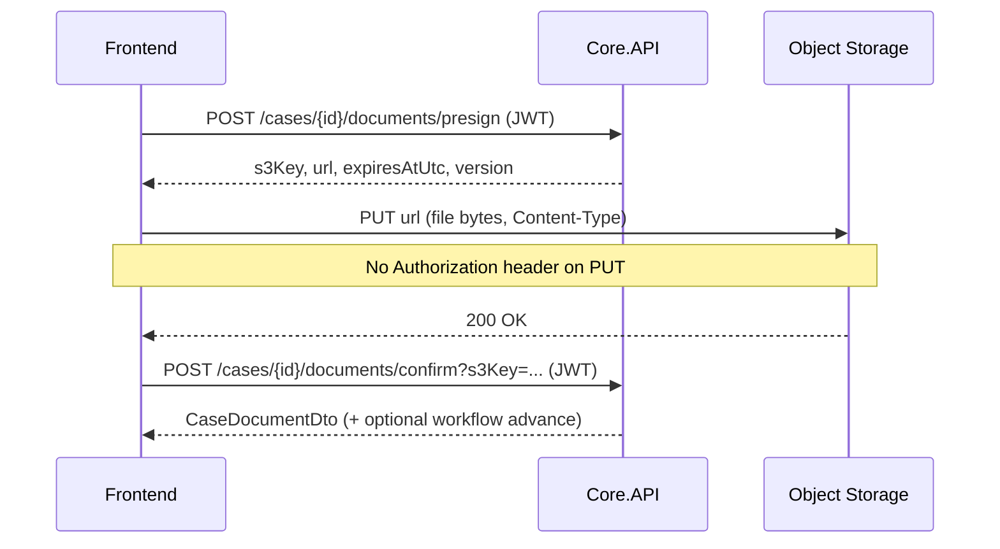
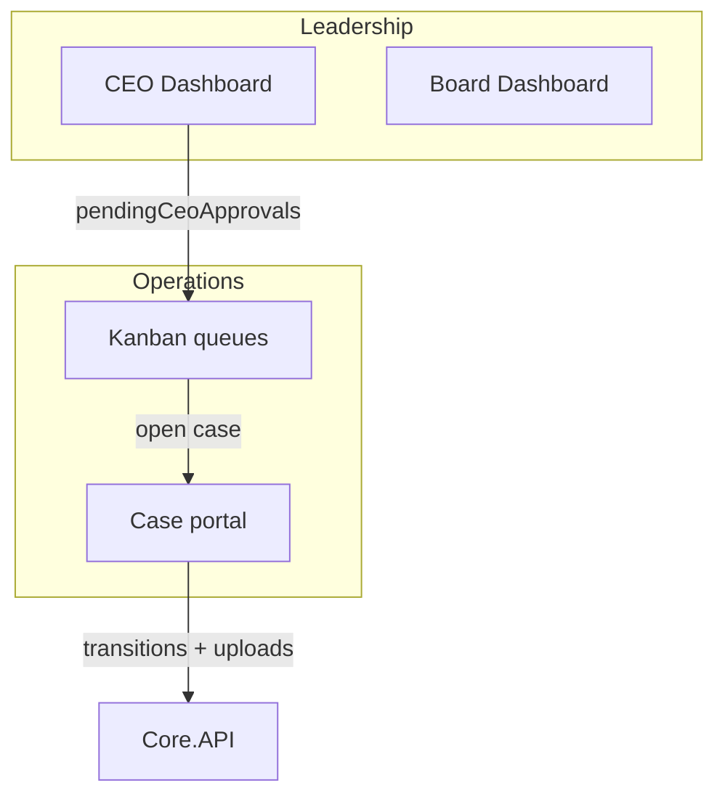

# Investment Case API — Frontend Integration Guide

This document describes the **end-to-end investment application lifecycle**, who acts at each step, which APIs to call, and how responses are shaped. It is written for frontend engineers integrating with **Financial-Core** (`Core.API`).

**API version:** `v1.0`  
**Base path:** `/api/v1.0/...`  
**Authentication:** `Authorization: Bearer <access_token>` (JWT), except where noted.

---

## Table of contents

1. [How the system is structured](#1-how-the-system-is-structured)
2. [Response envelope and errors](#2-response-envelope-and-errors)
3. [Authentication and companies (prerequisites)](#3-authentication-and-companies-prerequisites)
4. [Lifecycle overview](#4-lifecycle-overview)
5. [Scenario guide — stage by stage](#5-scenario-guide--stage-by-stage)
6. [Documents & client-side upload (mandatory pattern)](#6-documents--client-side-upload-mandatory-pattern)
7. [Kanban (work queue)](#7-kanban-work-queue)
8. [Management dashboards](#8-management-dashboards)
9. [Terminal and exceptional flows](#9-terminal-and-exceptional-flows)
10. [Reference tables](#10-reference-tables)
11. [Complete API catalog](#11-complete-api-catalog)
12. [Reference frontend implementation](#12-reference-frontend-implementation)

---

## 1. How the system is structured

Three layers drive behavior. The frontend should treat **`currentStatus`** on the case as the source of truth for UI routing.

| Layer | Responsibility | Frontend impact |
|--------|----------------|-----------------|
| **Domain state machine** (`CaseStateManager`) | Legal transitions: `(status, action, role) → next status`, business rules, permissions | Drive buttons, validation, and “what’s allowed now” |
| **Application services** (`InvestmentCaseAppService`) | HTTP use cases, persistence, comments, documents, payments | Call the REST endpoints below |
| **Elsa workflow** (`InvestmentCaseWorkflow`) | Background orchestration; resumes on `status-changed` signal | You do **not** call Elsa directly; transitions already signal it |

```mermaid
stateDiagram-v2
    direction LR
    [*] --> Draft
    Draft --> DataEntry1: Applicant Submit
    DataEntry1 --> ReviewDataEntry1: Applicant Submit
    ReviewDataEntry1 --> DataEntry2: Expert Approve
    ReviewDataEntry1 --> DataEntry1: Expert Revision
    ReviewDataEntry2 --> InitialValuation: Expert Approve
    InitialValuation --> SecondaryValuation: Manager Approve
    SecondaryValuation --> WaitingPreliminaryContract: Manager Approve
    WaitingPreliminaryContract --> WaitingUserReviewPreliminaryContract: Legal upload
    WaitingUserReviewPreliminaryContract --> ContractDrafting: Applicant Approve
    ContractDrafting --> WaitingContractSignature: Legal finalize
    WaitingContractSignature --> WaitingSignedContractUpload: Legal confirm signature
    WaitingSignedContractUpload --> WaitingFinancialWorksheet: Legal upload signed
    WaitingFinancialWorksheet --> FinancialWorksheetReview: Expert submit worksheet
    FinancialWorksheetReview --> WaitingCeoApproval: Finance approve
    WaitingCeoApproval --> WaitingPayment: CEO approve
    WaitingPayment --> Completed: Payments complete
```



> **Note:** `WaitingCeoApproval` exists in the domain model but is not a separate node in the Elsa flowchart. UI must follow `currentStatus`, not Elsa activity IDs.

### Phases vs statuses

- **`CasePhase`** — coarse grouping for UI sections (Application → Valuation → Legal → Finance → Closing).
- **`CaseStatus`** — fine-grained step; always check this for actions.

| Phase | Value | Typical statuses |
|-------|-------|------------------|
| Application | 1 | Draft, DataEntry1, ReviewDataEntry1, DataEntry2, ReviewDataEntry2 |
| Valuation | 2 | InitialValuation, SecondaryValuation |
| Legal | 3 | WaitingPreliminaryContract … WaitingSignedContractUpload |
| Finance | 4 | WaitingFinancialWorksheet, FinancialWorksheetReview, WaitingCeoApproval |
| Closing | 5 | WaitingPayment, Completed |

### Roles (JWT `role` claim)

| Role | Typical actor |
|------|----------------|
| `Applicant` | Startup / company applicant (`User` in registration may map here) |
| `InvestmentExpert` | Reviews application forms |
| `InvestmentManager` | Valuation approvals |
| `LegalExpert` / `LegalManager` | Contracts (manager can mirror expert actions) |
| `FinancialExpert` / `FinancialManager` | Worksheet & payments |
| `CEO` | Final approval before payment |
| `Admin` | Broad override + archive |

**Manager mirroring:** `InvestmentManager` can perform `InvestmentExpert` transitions; same for Legal and Financial pairs.

---

## 2. Response envelope and errors

Successful investment-case endpoints return **`ApiOperationResult<T>`**:

```json
{
  "success": true,
  "message": "Human-readable success message",
  "operationDate": "2026-05-14T06:00:00Z",
  "status": 200,
  "data": { },
  "list": null,
  "totalCount": null,
  "validationErrors": null,
  "exMessage": null
}
```

Failures set `success: false`. HTTP status follows the error code:

| `exMessage` / error code | HTTP status |
|--------------------------|-------------|
| `validation_error` | 400 |
| `unauthorized` | 401 |
| `forbidden` | 403 |
| `not_found` | 404 |
| `conflict` | 409 (invalid transition, incomplete data, etc.) |

**Correlation:** Workflow transitions use the `X-Correlation-Id` header (or trace id) for idempotency on retries.

**Transition HTTP codes:** Most workflow actions return **202 Accepted** with an empty/minimal body; reads return **200**.

---

## 3. Authentication and companies (prerequisites)

### 3.1 Auth flow (applicant & staff)

| Step | Method | Endpoint | Body | Notes |
|------|--------|----------|------|-------|
| Send OTP | `POST` | `/api/v1.0/panel/users/send-otp` | `{ "phoneNumber": "09..." }` | Anonymous |
| Verify OTP | `POST` | `/api/v1.0/panel/users/verify-otp` | `{ "phoneNumber", "otpCode" }` | Returns `LoginDto` with tokens |
| Refresh | `POST` | `/api/v1.0/panel/users/refresh-token` | `{ refresh token fields }` | Optional `Authorization: Bearer` access token |
| Profile | `GET` | `/api/v1.0/panel/users/profile` | — | Authorized |
| Logout | `POST` | `/api/v1.0/panel/users/logout` | — | Authorized |

Store **`accessToken`** from `loginDto.tokenModel` and send it on all case APIs.

### 3.2 Company profile (company applicants only)

Before creating a **company** case, register the company:

| Method | Endpoint | Purpose |
|--------|----------|---------|
| `GET` | `/api/v1.0/panel/companies/mine` | List applicant’s companies |
| `POST` | `/api/v1.0/panel/companies` | Create company |
| `PUT` | `/api/v1.0/panel/companies/{id}` | Update company |

**`SaveCompanyRequest`:** `name`, `economicCode`, optional `registrationNumber`, `nationalId`, `phoneNumber`, `address`, `city`, `province`, `postalCode`.

---

## 4. Lifecycle overview

High-level happy path:

1. Applicant **creates** case → `Draft`
2. Applicant fills **Data Entry 1** + pitch deck → **submits** → expert review
3. Expert **approves** → applicant fills **Data Entry 2** + documents → **submits**
4. Expert **approves** → **valuation** (record + manager approvals ×2)
5. Legal **preliminary contract** → applicant **reviews** → drafting → signature → **signed contract**
6. Investment expert **financial worksheet** → finance **review** → **CEO approval**
7. Finance **records/confirms payments** → case **Completed**

At any non-terminal stage, internal roles may **reject**; applicant/staff may **cancel** (where allowed); admin may **archive**.

---

## 5. Scenario guide — stage by stage

For each stage: **who**, **status**, **what to do in the UI**, **APIs in order**.

---

### Stage 0 — Create the case

**Actor:** Applicant (`ApplicantOnly` policy)  
**Starting status:** `Draft` (1)  
**Phase:** Application

#### UI goals

- Choose applicant type: Individual (1) or Company (2).
- For company: pick `companyId` from `/panel/companies/mine`.
- After create, show case detail and Data Entry 1 form.

#### APIs

| Order | Method | Endpoint | Request | Response |
|-------|--------|----------|---------|----------|
| 1 | `POST` | `/api/v1.0/cases` | `CreateInvestmentCaseRequest` | `201` + `InvestmentCaseApplicantDto` |

```json
{
  "applicantType": 2,
  "companyId": "3fa85f64-5717-4562-b3fc-2c963f66afa6"
}
```

- `applicantType`: `1` = Individual, `2` = Company (`companyId` required for company).
- Backend starts Elsa workflow and sets `workflowInstanceId` internally.

#### Optional: open application from Draft

`POST .../data-entry1/submit` while status is **`Draft`** moves to **`DataEntry1`** (no full validation). Use once if you need an explicit “Start application” step.

---

### Stage 1 — Data Entry 1 (application form)

**Actor:** Applicant  
**Statuses:** `Draft` or `DataEntry1` (editable), then `ReviewDataEntry1` after submit  
**Phase:** Application

#### UI goals

- Form fields: business stage, requested amount (representative name/email come from user profile).
- Upload **PitchDeck** (`documentType: 1`) before submit using the **client presign → PUT → confirm** flow (see [§6](#6-documents--client-side-upload-mandatory-pattern)).
- Submit sends case to investment expert queue.

#### APIs

| Step | Method | Endpoint | Body / notes |
|------|--------|----------|--------------|
| Save draft | `PUT` | `/api/v1.0/cases/{id}/data-entry1` | See below |
| Upload pitch deck | — | [§6 Documents](#6-documents--client-side-upload-mandatory-pattern) | `documentType: 1`; upload from browser, not API |
| Submit | `POST` | `/api/v1.0/cases/{id}/data-entry1/submit` | Optional JSON: `{ "comment": "..." }` or empty body |
| Poll detail | `GET` | `/api/v1.0/cases/{id}` | Check `currentStatus` |

**`UpdateDataEntry1Request`:**

```json
{
  "businessStage": 1,
  "requestedAmount": 5000000000
}
```

**`businessStage`:** `1` = Idea, `2` = HasPrototype.

#### Submit validation (409 if failed)

- Data entry 1 saved.
- `representativeFullName`, `contactEmail`, `requestedAmount > 0`, `businessStage` is Idea or HasPrototype.
- At least one document with `documentType: PitchDeck` (1).

#### Expert side (next stage)

Expert sees case in kanban **action required** when status is `ReviewDataEntry1`.

---

### Stage 2 — Review Data Entry 1

**Actor:** Investment Expert (or Manager / Admin)  
**Status:** `ReviewDataEntry1` (3)

#### UI goals

- Show submitted DE1 + documents.
- Approve, request revision (message required), or reject.

#### APIs

| Action | Method | Endpoint | Body |
|--------|--------|----------|------|
| Approve | `POST` | `.../data-entry1/approve` | `{ "comment": "...", "internalComment": "..." }` |
| Revision | `POST` | `.../data-entry1/revision-request` | `{ "message": "required" }` |
| Reject | `POST` | `.../reject` | `{ "reason": "..." }` |

**Outcomes:**

| Action | Next status |
|--------|-------------|
| Approve | `DataEntry2` (4) |
| Revision | `DataEntry1` (2) |
| Reject | `Rejected` (17) |

`internalComment` on approve is stored as an internal comment (experts only); requires `cases:create_internal_comment`.

---

### Stage 3 — Data Entry 2 + documents

**Actor:** Applicant  
**Status:** `DataEntry2` (4) → `ReviewDataEntry2` (5) after submit

#### UI goals

- Text field: investment attraction basis.
- Upload **all required document types** (see table below).
- Submit for expert review.

#### APIs

| Step | Method | Endpoint |
|------|--------|----------|
| Save | `PUT` | `/api/v1.0/cases/{id}/data-entry2` |
| Documents | Presign/upload/confirm | See §6 |
| Submit | `POST` | `/api/v1.0/cases/{id}/data-entry2/submit` |

**`UpdateDataEntry2Request`:**

```json
{
  "investmentAttractionBasis": "..."
}
```

#### Required documents for submit

| DocumentType | Value |
|--------------|-------|
| CompanyIntroduction | 12 |
| EmployeeInsuranceList | 13 |
| TrialBalanceScan | 14 |
| TaxDocuments | 3 |
| ActivityLicenses | 15 |
| CompanyRegistration | 4 |
| CapitalRaisingPlans | 19 |

#### Expert review

Same pattern as Stage 2:

- `POST .../data-entry2/approve`
- `POST .../data-entry2/revision-request`
- `POST .../reject`

Approve → **`InitialValuation` (6)**.

---

### Stage 4 — Valuation (primary & secondary)

**Actors:** Investment Manager (approve transitions); experts typically **record** amounts first  
**Statuses:** `InitialValuation` (6) → `SecondaryValuation` (7) → `WaitingPreliminaryContract` (8)  
**Phase:** Valuation

#### UI goals

1. While status is `InitialValuation`: record primary valuation, then manager approves.
2. While status is `SecondaryValuation`: record secondary valuation, then manager approves.

#### APIs

| Step | Method | Endpoint | When |
|------|--------|----------|------|
| Record primary | `POST` | `/api/v1.0/cases/{id}/valuations` | Status = `InitialValuation` |
| Approve primary | `POST` | `/api/v1.0/cases/{id}/valuations/initial/approve` | After record |
| Record secondary | `POST` | `/api/v1.0/cases/{id}/valuations` | Status = `SecondaryValuation` |
| Approve secondary | `POST` | `/api/v1.0/cases/{id}/valuations/secondary/approve` | After record |

**`RecordValuationRequest`:**

```json
{
  "type": 1,
  "amount": 10000000000,
  "notes": "optional"
}
```

`type`: `1` = Primary, `2` = Secondary.

**Optional:** `POST .../evaluations` and `GET .../evaluations` for structured expert evaluations (`CaseEvaluationUpsertRequest` with `phase`, `notes`, `items[]`).

---

### Stage 5 — Legal: preliminary contract

**Actor:** Legal expert  
**Status:** `WaitingPreliminaryContract` (8) → `WaitingUserReviewPreliminaryContract` (9)  
**Phase:** Legal

#### UI goals

- Upload pre-contract document (`PreContract` = 7).
- Confirm upload; workflow can auto-advance when legal has `cases:manage_contracts`.

#### APIs

**Required flow:** [§6.1 three-step upload](#61-the-three-step-upload-contract) — presign → **browser PUT** → confirm.  
After confirm, status may move to `WaitingUserReviewPreliminaryContract` automatically.

**Do not** use legacy `contracts/preliminary/upload?s3Key=` unless the file is already in storage from another system.

---

### Stage 6 — Applicant reviews preliminary contract

**Actor:** Applicant  
**Status:** `WaitingUserReviewPreliminaryContract` (9)

#### APIs

| Action | Method | Endpoint |
|--------|--------|----------|
| Accept | `POST` | `.../contracts/preliminary/approve` | `{ "comment": "..." }` |
| Request changes | `POST` | `.../contracts/preliminary/revision-request` | `{ "message": "..." }` → back to `WaitingPreliminaryContract` |
| Cancel | `POST` | `.../cancel` | `{ "reason": "..." }` |

Approve → **`ContractDrafting` (10)**.

**Comments:** `POST .../comments` allowed in this legal review phase (applicant feedback).

---

### Stage 7 — Contract drafting, signature, signed upload

**Actor:** Legal expert  
**Statuses:** `ContractDrafting` (10) → `WaitingContractSignature` (11) → `WaitingSignedContractUpload` (12) → `WaitingFinancialWorksheet` (13)

#### APIs (sequential)

| Step | Method | Endpoint | Transition |
|------|--------|----------|------------|
| Finalize draft | `POST` | `.../contracts/finalize-draft` | → `WaitingContractSignature` |
| Confirm signature ready | `POST` | `.../contracts/confirm-signature` | → `WaitingSignedContractUpload` |
| Upload signed contract | Document flow or `POST .../contracts/signed/upload?s3Key=` | `SignedContract` (9) | → `WaitingFinancialWorksheet` |

---

### Stage 8 — Financial worksheet

**Actors:** Investment Expert (submit), Financial Expert (approve / revision)  
**Statuses:** `WaitingFinancialWorksheet` (13) → `FinancialWorksheetReview` (14) → `WaitingCeoApproval` (20)

#### UI goals

- Expert fills worksheet (bank, IBAN, approved amount).
- Expert submits → finance reviews.
- Finance approves → CEO queue.

#### APIs

| Step | Method | Endpoint |
|------|--------|----------|
| Update worksheet | `PUT` | `/api/v1.0/cases/{id}/financial-worksheet` |
| Submit | `POST` | `.../financial-worksheet/submit` |
| Approve (finance) | `POST` | `.../financial-worksheet/approve` |
| Revision | `POST` | `.../financial-worksheet/revision-request` |

**`UpdateFinancialWorksheetRequest`:**

```json
{
  "bankName": "...",
  "iban": "IR...",
  "approvedAmount": 8000000000,
  "paymentSchedule": "optional",
  "notes": "optional"
}
```

Submit/approve require `approvedAmount > 0`.

---

### Stage 9 — CEO approval

**Actor:** CEO (`InvestmentCases.CeoApprove` policy + `cases:ceo_approve` permission)  
**Status:** `WaitingCeoApproval` (20)

#### APIs

| Action | Method | Endpoint |
|--------|--------|----------|
| Approve | `POST` | `/api/v1.0/cases/{id}/ceo-approval/approve` |
| Send back | `POST` | `/api/v1.0/cases/{id}/ceo-approval/revision-request` |

Approve → **`WaitingPayment` (15)**.

**Dashboard:** `GET /api/v1.0/dashboard/ceo` — pipeline metrics including `pendingCeoApprovals`.

---

### Stage 10 — Payments & completion

**Actor:** Financial expert  
**Status:** `WaitingPayment` (15) → `Completed` (16)  
**Phase:** Closing

#### UI goals

- Show `approvedAmount`, recorded vs confirmed totals (`GET .../payments`).
- Record installments; confirm each payment.
- When sum of **completed** payments ≥ `approvedAmount`, backend **auto-completes** the case.

#### APIs

| Step | Method | Endpoint |
|------|--------|----------|
| List + summary | `GET` | `/api/v1.0/cases/{id}/payments` |
| Record payment | `POST` | `/api/v1.0/cases/{id}/payments` |
| Confirm payment | `POST` | `/api/v1.0/cases/{id}/payments/{paymentId}/confirm` |
| Cancel payment | `POST` | `/api/v1.0/cases/{id}/payments/{paymentId}/cancel` |

**`RecordPaymentRequest`:**

```json
{
  "amount": 2000000000,
  "paymentDate": "2026-05-01",
  "transactionNumber": "TX-001",
  "receiptS3Key": "optional",
  "notes": null,
  "method": 1,
  "status": 1
}
```

- `method`: `1` BankTransfer, `2` Cheque, `3` Cash, `4` Other  
- `status`: `1` Pending, `2` Completed, `3` Cancelled, `4` Failed  

**Tip:** Recording with `status: 2` (Completed) may trigger auto-complete immediately if totals suffice; otherwise use **confirm** after review.

**`CasePaymentsDto`:**

- `payments[]` — line items  
- `summary`: `approvedAmount`, `totalRecorded`, `totalConfirmed`, `remainingToComplete`

---

### Ongoing — Case detail, search, history

| Need | Method | Endpoint |
|------|--------|----------|
| Full case (role-shaped DTO) | `GET` | `/api/v1.0/cases/{id}` |
| Applicant list/search | `GET` | `/api/v1.0/cases?caseNumber=&phase=&status=&page=&pageSize=` |
| Audit trail (internal sees actor/action) | `GET` | `/api/v1.0/cases/{id}/history` |

**Applicant `GET` case** includes: `company`, `applicant`, `dataEntry1`, `dataEntry2` when applicable.  
**Internal `GET`** adds `applicantUserId`, `workflowInstanceId`.

---

## 6. Documents & client-side upload (mandatory pattern)

> **Critical rule for production UI:** File bytes must be uploaded **from the browser (or mobile client) directly to object storage** using the presigned URL. The API server does **not** receive the file during normal applicant/legal flows except when you explicitly choose the optional multipart shortcut.

The reference implementation lives in:

| File | Responsibility |
|------|----------------|
| `Frontend/js/portal.js` | `uploadDocument()`, `downloadDocument()`, document UI per stage, `refreshCase()` |
| `Frontend/js/workflow-model.js` | Document lists per stage (`DATA_ENTRY_1_DOCUMENTS`, `DATA_ENTRY_2_DOCUMENTS`) |
| `Frontend/app.js` | Low-level presign/PUT/confirm debugger, CEO/board dashboards |
| `Frontend/js/kanban.js` | Kanban lists + navigation to case portal |
| `Frontend/workflow-runner.js` | E2E automation using the same upload helper |

---

### 6.1 The three-step upload contract

Every upload in the portal follows the same sequence:



#### Step 1 — Presign (authenticated API call)

```http
POST /api/v1.0/cases/{caseId}/documents/presign
Authorization: Bearer {accessToken}
Content-Type: application/json

{
  "documentType": 1,
  "fileName": "pitch-deck.pdf",
  "mimeType": "application/pdf",
  "fileSize": 1048576
}
```

**Response `data`:**

```json
{
  "s3Key": "cases/CASE-2026-00042/1/1.pdf",
  "url": "https://storage.example.com/...",
  "expiresAtUtc": "2026-05-14T10:15:00Z",
  "version": 1
}
```

- URL is valid for **~15 minutes**.
- Backend pre-computes `s3Key` and `version`; the client must use **exactly** this key at confirm time.
- **Pattern:** `cases/{caseNumber}/{documentType}/{version}{extension}`

#### Step 2 — PUT file to storage (browser `fetch`, not `apiRequest`)

```javascript
// Reference: Frontend/js/portal.js → uploadDocument()
const putRes = await fetch(uploadUrl, {
  method: "PUT",
  headers: { "Content-Type": mimeType },
  body: file, // File or Blob from <input type="file">
});
if (!putRes.ok) throw new Error("Upload failed: " + putRes.status);
```

| Do | Don't |
|----|--------|
| Use `fetch` / `XMLHttpRequest` to the presigned `url` | Send `Authorization: Bearer` on the PUT (often breaks signature) |
| Set `Content-Type` to the same mime you sent to presign | Proxy the file through your API server in production |
| Upload the raw file body | JSON-encode the file |

#### Step 3 — Confirm (authenticated API call)

```http
POST /api/v1.0/cases/{caseId}/documents/confirm?s3Key={encodeURIComponent(s3Key)}
Authorization: Bearer {accessToken}
```

- Body is empty (`json: false` in the test panel).
- Backend verifies the object exists in storage, creates the `CaseDocument` row, and may **auto-advance workflow** for contract types (see §6.5).

**Portal behavior after confirm:** `refreshCase()` reloads `GET /cases/{id}`, `/documents`, `/documents/latest`, and version groups so the UI shows checkmarks before submit.

---

### 6.2 Reference helper (copy this pattern)

```javascript
async function uploadDocument(api, caseId, documentType, file) {
  const mimeType = file.type || "application/octet-stream";

  const presign = unwrap(await api.post(`/cases/${caseId}/documents/presign`, {
    documentType: Number(documentType),
    fileName: file.name,
    mimeType,
    fileSize: file.size,
  }));

  const uploadUrl = presign.url ?? presign.Url;
  const s3Key = presign.s3Key ?? presign.S3Key;
  if (!uploadUrl || !s3Key) throw new Error("Presign response missing url or s3Key");

  const putRes = await fetch(uploadUrl, {
    method: "PUT",
    headers: { "Content-Type": mimeType },
    body: file,
  });
  if (!putRes.ok) throw new Error(`Storage PUT failed: ${putRes.status}`);

  await api.post(
    `/cases/${caseId}/documents/confirm?s3Key=${encodeURIComponent(s3Key)}`,
    null,
    { json: false }
  );

  return s3Key; // keep on input.dataset.s3Key for payments, etc.
}
```

**UX recommendation (portal pattern):** trigger upload on `<input type="file" change>` → show “uploading…” → on success mark row ✓ → call `refreshCase()`.

---

### 6.3 Which documents, when (aligned with `workflow-model.js`)

#### Data Entry 1 — applicant (`Draft` / `DataEntry1`)

| documentType | Label (FA) | Required for submit |
|-------------:|--------------|---------------------|
| 1 | Pitch deck | **Yes** |
| 11 | Business plan | No |
| 99 | Other | No |

Backend submit rule: at least one `PitchDeck` (1) must exist.

#### Data Entry 2 — applicant (`DataEntry2`)

| documentType | Label (FA) | Required for submit |
|-------------:|--------------|---------------------|
| 12 | Company introduction | **Yes** |
| 13 | Employee insurance list | **Yes** |
| 14 | Trial balance scan | **Yes** |
| 3 | Tax documents | **Yes** |
| 15 | Activity licenses | **Yes** |
| 4 | Company registration | **Yes** |
| 19 | Capital raising plans | **Yes** |
| 2, 6, 16, 17, 18 | Various optional docs | No |

Portal checks completeness via `documents/latest` before enabling submit (`de2RequiredDocumentsComplete()`).

#### Legal — internal only

| documentType | Status gate | Auto workflow on confirm |
|-------------:|-------------|---------------------------|
| 7 `PreContract` | `WaitingPreliminaryContract` (8) | → `WaitingUserReviewPreliminaryContract` |
| 8 `FinalContract` | `ContractDrafting` / `WaitingContractSignature` | No auto transition |
| 9 `SignedContract` | `WaitingSignedContractUpload` (12) | → `WaitingFinancialWorksheet` |

Legal uploads use `data-contract-kind="preliminary"` or `"signed"` in the portal (maps to types 7 and 9).

#### Payments — internal

| documentType | Status gate |
|-------------:|-------------|
| 10 `PaymentReceipt` | `WaitingPayment` (15) |

Receipt upload uses the same presign flow; `receiptS3Key` is sent in `RecordPaymentRequest`.

---

### 6.4 Who may upload what (server validation)

| Actor | Allowed document types | Allowed statuses (summary) |
|-------|------------------------|----------------------------|
| Applicant | DE1/DE2 types (not contracts/receipts) | `Draft`, `DataEntry1`, `DataEntry2` (+ confirm during review while upload finishes) |
| Legal (`cases:manage_contracts`) | 7, 8, 9 | Per contract stage (see §6.3) |
| Financial (`cases:manage_payments`) | 10 | `WaitingPayment` |
| Other internal (`cases:upload_documents`) | As permitted by status | Varies |

Applicants receive **403** if they try to presign `PreContract`, `SignedContract`, or `PaymentReceipt`.

---

### 6.5 Confirm side effects (workflow)

After `confirm`, the API may call internal transitions **without a separate button**:

| Document type | If status is | Action applied |
|---------------|--------------|----------------|
| `PreContract` (7) | `WaitingPreliminaryContract` | `UploadPreliminaryContract` |
| `SignedContract` (9) | `WaitingSignedContractUpload` | `UploadSignedContract` |

If the case is already past that step, confirm is idempotent (document row only).

**Frontend implication:** after legal uploads, refresh case status — the card may jump to the next stage automatically.

---

### 6.6 Reading documents (download & lists)

After any case load, the portal fetches:

| Call | Purpose |
|------|---------|
| `GET /cases/{id}/documents` | Full list |
| `GET /cases/{id}/documents/latest` | Highest version per type — used for ✓/✗ checklist |
| `GET /cases/{id}/documents/version-groups?scope={scope}` | Version history UI |

**Version group `scope` query** (see `DocumentVersionScopes`):

| scope | Includes |
|-------|----------|
| `data-entry` | Pitch deck, financials, tax, registration, etc. |
| `preliminary` | Pre-contract only |
| `contracts` | Pre-contract, final, signed |
| omitted / `all` | All types on case |

**Portal scope selection logic** (`refreshCase` in `portal.js`):

- Internal + status `ReviewDataEntry1` or `ReviewDataEntry2` → `data-entry`
- Applicant + `WaitingUserReviewPreliminaryContract` → `preliminary`
- Internal + legal statuses 8–12 → `contracts`

#### Download options

| Pattern | When to use | API |
|---------|-------------|-----|
| **Stream through API** (portal default) | Same-origin download with JWT | `GET .../documents/{documentId}/download` → binary + `Content-Disposition` |
| **Presigned URL** | Open in new tab / CDN | `GET .../documents/{documentId}/download?presign=true` → `{ url, expiresAtUtc }` |

```javascript
// Reference: portal.js → downloadDocument() — authenticated GET, no presign
const res = await fetch(apiUrl + `/cases/${caseId}/documents/${documentId}/download`, {
  headers: { Authorization: "Bearer " + token },
});
const blob = await res.blob();
// trigger browser download from blob
```

---

### 6.7 Re-uploads and versioning

- Each presign for the same `documentType` increments **version** (`…/type/2.pdf`, `…/3.pdf`).
- Submit validators use **latest** document per required type (`documents/latest`).
- Experts see older versions via `version-groups` (e.g. applicant revised pitch deck after revision request).

**Do not** reuse an old `s3Key` after a failed PUT — always presign again.

---

### 6.8 Optional: server-side multipart (not the main product path)

```
POST /api/v1.0/cases/{caseId}/documents/upload
Content-Type: multipart/form-data
  documentType: 1
  file: (binary)
```

The API uploads to storage and confirms in one shot. The **production portal does not use this** for case forms; it exists for tooling/tests (`Frontend/app.js` multipart debugger). Prefer presign for scalability and progress UI.

**Legacy contract shortcuts** (only if file already in storage with known key):

- `POST .../contracts/preliminary/upload?s3Key=`
- `POST .../contracts/signed/upload?s3Key=`

These delegate to `confirm` internally.

---

### 6.9 Comment attachments (same storage pattern)

1. Presign + PUT + confirm (or reuse upload helper) to obtain `s3Key`.
2. `POST /cases/{id}/comments/{commentId}/attachments?s3Key=...&fileName=...`

---

### 6.10 Document checklist for frontend QA

- [ ] Presign sends exact `fileSize` and `mimeType` from the selected `File`
- [ ] PUT uses **no** JWT header
- [ ] Confirm URL-encodes `s3Key`
- [ ] After confirm, refresh `documents/latest` before enabling Submit
- [ ] Legal contract upload refreshes case status (auto-transition)
- [ ] Applicant cannot presign contract types
- [ ] Download uses JWT stream OR presign for external viewers
- [ ] Show version history when `scope` applies (expert review / contract rounds)

---

## 7. Kanban (work queue)

The kanban is the **internal/applicant home** for “what needs my attention” vs “what am I tracking”. Implementation: `Frontend/js/kanban.js` + APIs backed by `KanbanAppService` / `CaseKanbanRules`.

### 7.1 Two boards

| Board | Endpoint | Meaning |
|-------|----------|---------|
| **Action required** | `GET /api/v1.0/cases/kanban/action-required` | Cases where **your role owns** the current status |
| **Watching** | `GET /api/v1.0/cases/kanban/watching` | Active cases you don’t own right now but may care about |

Load both in parallel on dashboard mount (see `kanban.js` → `load()`).

**Access:**

- Authenticated users with `cases:read_own` (applicants) or `cases:read_all` (internal).
- Applicants only see **their** cases; internal users see scoped lists per repository rules.

### 7.2 Card shapes

**Action required — `KanbanCaseCardDto`:**

```json
{
  "id": "guid",
  "caseNumber": "CASE-2026-00001",
  "currentPhase": 1,
  "phaseTitle": "درخواست",
  "currentStatus": 3,
  "statusTitle": "بررسی فرم اولیه",
  "applicantType": 2,
  "startupTitle": null,
  "companyName": "Acme Co",
  "createdAt": "...",
  "updatedAt": "...",
  "pendingActionLabel": "بررسی و تأیید/اصلاح فرم اولیه",
  "allowedActions": ["Approve", "RequestRevision", "Reject"]
}
```

**Watching — `KanbanCaseSummaryDto`:** same metadata without `allowedActions` / company fields (lighter).

### 7.3 How “action required” is computed

Backend maps each `CaseStatus` → **owner role** (e.g. `ReviewDataEntry1` → `InvestmentExpert`, `WaitingCeoApproval` → `CEO`).  
Your JWT roles are collapsed to one **workflow role** via `CaseKanbanRules.ResolveWorkflowRole` (CEO > managers > experts > applicant).

- **Action required** = current status is non-terminal AND your workflow role owns that status.
- **Managers** mirror experts (Investment Manager sees expert queues, etc.).
- **Admin** sees all statuses as action-required (broad visibility).

`allowedActions` comes from `CaseStateManager.GetAllowedActions(currentStatus, role)` — use it to render quick-action chips on the card (portal shows up to 6).

`pendingActionLabel` is a Persian UX string (e.g. “در انتظار واحد حقوقی”) — display prominently on the card.

### 7.4 Navigation pattern (portal integration)

```javascript
// kanban.js — clicking a card:
panel.setCurrentCaseId(caseId);
document.dispatchEvent(new CustomEvent("testpanel:case-changed", { detail: { caseId } }));
// switch to case portal tab → initPortal loads full case + stage UI
```

**Refresh kanban when:**

- Session changes (login/logout)
- Case transitions complete (`testpanel:case-changed` event from portal)
- User clicks refresh (`kanbanRefresh()`)

### 7.5 Applicant vs internal kanban UX

| Role | Action required typical content | Watching typical content |
|------|--------------------------------|--------------------------|
| Applicant | Draft, DataEntry1/2, preliminary contract review | Cases waiting on experts/legal/finance |
| InvestmentExpert | ReviewDataEntry1/2, financial worksheet prep | Valuation, legal, payment stages |
| InvestmentManager | Initial/secondary valuation | Application reviews, legal |
| LegalExpert | Contract upload/drafting/signature steps | Application & finance |
| FinancialExpert | Worksheet review, payments | CEO queue, application |
| CEO | WaitingCeoApproval | Most other active cases |

### 7.6 Kanban vs case detail page

| Concern | Kanban | Case portal (`portal.js`) |
|---------|--------|---------------------------|
| Purpose | Queue / triage | Full stage form + actions |
| Actions | Display `allowedActions` hints only | Executes POST transitions |
| Documents | Not listed | Full upload/download |
| Stepper | No | `WorkflowModel.getStepperSteps()` |

**Recommended flow:** Kanban card click → case detail → perform uploads/transitions → return to kanban (auto-refresh).

---

## 8. Management dashboards

Executive views are **read-only aggregates** for leadership; they do not replace kanban or case detail.

**Reference UI:** `Frontend/app.js` → `wireDashboard()`  
**API:** `DashboardController` + `ExecutiveDashboardService`

### 8.1 CEO dashboard

```http
GET /api/v1.0/dashboard/ceo
Authorization: Bearer {token}
Policy: Dashboard.Ceo (roles: CEO, Admin)
```

**`CeoDashboardDto` fields (use camelCase or PascalCase from JSON):**

| Field | Meaning |
|-------|---------|
| `totalActiveCases` | Non-terminal cases |
| `completedCases` | Count in `Completed` |
| `casesThisMonth` | Created this calendar month |
| `averageDaysInReview` | Avg review duration metric |
| `totalRequestedAmount` | Sum of DE1 requested amounts |
| `approvedPaymentsSum` | Sum of completed payments |
| `pendingCeoApprovals` | Cases in `WaitingCeoApproval` (20) |
| `waitingPaymentCount` | Cases in `WaitingPayment` (15) |
| `rejectedCount` | Rejected cases |
| `completionRate` | % completed vs total |
| `activePipelineRequestedAmount` | Requested amount on active pipeline |
| `pipelineByStatus` | `[{ status, statusTitle, count }]` — funnel chart |
| `topStatuses` | Subset for highlights |
| `recentActivity` | `[{ caseId, caseNumber, fromStatus, toStatus, action, createdAt }]` |

**Frontend widgets (reference):**

- Metric grid (active, completed, CEO pending, payment pending, amounts).
- Bar chart from `pipelineByStatus` (`renderBarChart` in `app.js`).
- Recent activity list — link `caseId` to case portal.

### 8.2 Board dashboard

```http
GET /api/v1.0/dashboard/board
Policy: Dashboard.Board (CEO, InvestmentManager, Admin)
```

**`BoardDashboardDto`:**

| Field | Meaning |
|-------|---------|
| `totalCases` | All non-deleted cases |
| `completionRate` | % completed |
| `countsByStatus` | Bar chart data |
| `countsByPhase` | Phase distribution |
| `monthlyTrend` | `[{ year, month, count }]` — registration trend |

Use for leadership “macro” view; drill-down is still per-case via kanban or search.

### 8.3 Dashboard vs kanban vs portal



---

## 9. Terminal and exceptional flows

### Reject (internal)

- **When:** Most review/valuation/legal/finance steps  
- **API:** `POST /api/v1.0/cases/{id}/reject` — `{ "reason": "..." }`  
- **Result:** `Rejected` (17) — terminal

### Cancel

- **Who:** Applicant (early stages), financial expert (waiting payment), others per state machine  
- **API:** `POST /api/v1.0/cases/{id}/cancel` — `{ "reason": "..." }`  
- **Result:** `Cancelled` (18)

### Archive (admin)

- **API:** `POST /api/v1.0/cases/{id}/archive` — `{ "reason": "..." }`  
- **Result:** `Archived` (19)

### Comments

| Endpoint | Notes |
|----------|-------|
| `GET .../comments?includeInternal=false` | Applicants must use `false` |
| `POST .../comments` | `{ "phase", "message", "isInternal", "parentId?" }` |
| `POST .../comments/{commentId}/attachments?s3Key=&fileName=` | After presign upload |

---

## 10. Reference tables

### CaseStatus enum

| Value | Name | Owner role (kanban) |
|------:|------|---------------------|
| 1 | Draft | Applicant |
| 2 | DataEntry1 | Applicant |
| 3 | ReviewDataEntry1 | InvestmentExpert |
| 4 | DataEntry2 | Applicant |
| 5 | ReviewDataEntry2 | InvestmentExpert |
| 6 | InitialValuation | InvestmentManager |
| 7 | SecondaryValuation | InvestmentManager |
| 8 | WaitingPreliminaryContract | LegalExpert |
| 9 | WaitingUserReviewPreliminaryContract | Applicant |
| 10 | ContractDrafting | LegalExpert |
| 11 | WaitingContractSignature | LegalExpert |
| 12 | WaitingSignedContractUpload | LegalExpert |
| 13 | WaitingFinancialWorksheet | InvestmentExpert |
| 14 | FinancialWorksheetReview | FinancialExpert |
| 20 | WaitingCeoApproval | CEO |
| 15 | WaitingPayment | FinancialExpert |
| 16 | Completed | — |
| 17 | Rejected | — |
| 18 | Cancelled | — |
| 19 | Archived | — |

### WorkflowAction → typical API mapping

| Action | Value | Example endpoint |
|--------|------:|------------------|
| Submit | 1 | `data-entry1/submit`, `data-entry2/submit`, `financial-worksheet/submit` |
| Approve | 2 | `data-entry1/approve`, `valuations/initial/approve`, `ceo-approval/approve` |
| RequestRevision | 3 | `*/revision-request` |
| UploadPreliminaryContract | 4 | Auto via `PreContract` confirm |
| FinalizeContractDraft | 5 | `contracts/finalize-draft` |
| ConfirmSignature | 6 | `contracts/confirm-signature` |
| UploadSignedContract | 7 | Auto via `SignedContract` confirm |
| SubmitFinancialWorksheet | 8 | `financial-worksheet/submit` |
| ApproveFinancialWorksheet | 9 | `financial-worksheet/approve` |
| CompletePayment | 10 | Auto when payments confirmed |
| Reject | 11 | `reject` |
| Cancel | 12 | `cancel` |
| Archive | 13 | `archive` |

### Authorization policies (route level)

| Policy | Roles |
|--------|-------|
| `ApplicantOnly` | Applicant, Admin |
| `InternalOnly` | All expert/manager/CEO/admin internal roles |
| `InvestmentCases.CeoApprove` | CEO, Admin |
| `Dashboard.Ceo` | CEO, Admin |
| `Dashboard.Board` | CEO, InvestmentManager, Admin |

Fine-grained checks use permission strings such as `cases:create`, `cases:read_own`, `cases:manage_valuations`, `cases:manage_contracts`, `cases:manage_financial_worksheet`, `cases:manage_payments`, `cases:ceo_approve`.

---

## 11. Complete API catalog

### Investment cases — `/api/v1.0/cases`

| Method | Path | Auth | Description |
|--------|------|------|-------------|
| **Kanban** |
| GET | `/kanban/action-required` | ✓ | Cases needing current user’s action |
| GET | `/kanban/watching` | ✓ | Cases user is tracking |
| **Core** |
| POST | `/` | Applicant | Create case |
| GET | `/` | ✓ | Search/list cases |
| GET | `/{id}` | ✓ | Get case by id |
| GET | `/{id}/history` | ✓ | Workflow history |
| **Data entry 1** |
| PUT | `/{id}/data-entry1` | Applicant | Save DE1 |
| POST | `/{id}/data-entry1/submit` | Applicant | Submit DE1 / leave Draft |
| POST | `/{id}/data-entry1/approve` | Internal | Expert approve |
| POST | `/{id}/data-entry1/revision-request` | Internal | Expert revision |
| **Data entry 2** |
| PUT | `/{id}/data-entry2` | Applicant | Save DE2 |
| POST | `/{id}/data-entry2/submit` | Applicant | Submit DE2 |
| POST | `/{id}/data-entry2/approve` | Internal | Expert approve |
| POST | `/{id}/data-entry2/revision-request` | Internal | Expert revision |
| **Valuation** |
| POST | `/{id}/valuations` | Internal | Record valuation amount |
| POST | `/{id}/valuations/initial/approve` | Internal | Manager approve primary |
| POST | `/{id}/valuations/secondary/approve` | Internal | Manager approve secondary |
| **Contracts** |
| POST | `/{id}/contracts/preliminary/upload` | Internal | Legacy: confirm pre-contract by s3Key |
| POST | `/{id}/contracts/preliminary/approve` | Applicant | Applicant accepts pre-contract |
| POST | `/{id}/contracts/preliminary/revision-request` | Applicant | Applicant sends back |
| POST | `/{id}/contracts/finalize-draft` | Internal | Legal finalize draft |
| POST | `/{id}/contracts/confirm-signature` | Internal | Legal confirms signature step |
| POST | `/{id}/contracts/signed/upload` | Internal | Legacy: confirm signed contract |
| **Finance** |
| PUT | `/{id}/financial-worksheet` | Internal | Upsert worksheet |
| POST | `/{id}/financial-worksheet/submit` | Internal | Submit for finance review |
| POST | `/{id}/financial-worksheet/approve` | Internal | Finance approve → CEO |
| POST | `/{id}/financial-worksheet/revision-request` | Internal | Finance revision |
| POST | `/{id}/ceo-approval/approve` | CEO policy | CEO approve → payment |
| POST | `/{id}/ceo-approval/revision-request` | CEO policy | CEO send back to worksheet |
| GET | `/{id}/payments` | Internal | List payments + summary |
| POST | `/{id}/payments` | Internal | Record payment |
| POST | `/{id}/payments/{paymentId}/confirm` | Internal | Confirm payment |
| POST | `/{id}/payments/{paymentId}/cancel` | Internal | Cancel payment |
| **Terminal** |
| POST | `/{id}/reject` | Internal | Reject case |
| POST | `/{id}/cancel` | ✓ | Cancel case |
| POST | `/{id}/archive` | ✓ | Archive (admin) |
| **Documents** |
| POST | `/{id}/documents/presign` | ✓ | Get upload URL |
| POST | `/{id}/documents/upload` | ✓ | Multipart direct upload |
| POST | `/{id}/documents/confirm` | ✓ | Register uploaded file |
| GET | `/{id}/documents` | ✓ | List documents |
| GET | `/{id}/documents/latest` | ✓ | Latest per type |
| GET | `/{id}/documents/version-groups` | ✓ | Version groups |
| GET | `/{id}/documents/types/{documentType}/versions` | ✓ | Versions for type |
| GET | `/{id}/documents/{documentId}/download` | ✓ | Download / presign |
| **Evaluations & comments** |
| POST | `/{id}/evaluations` | Internal | Upsert evaluation |
| GET | `/{id}/evaluations` | ✓ | List evaluations |
| GET | `/{id}/comments` | ✓ | List comments |
| POST | `/{id}/comments` | ✓ | Add comment |
| POST | `/{id}/comments/{commentId}/attachments` | ✓ | Attach file to comment |

### Users — `/api/v1.0/panel/users`

| Method | Path | Auth |
|--------|------|------|
| POST | `/send-otp` | Anonymous |
| POST | `/verify-otp` | Anonymous |
| POST | `/refresh-token` | Anonymous |
| POST | `/logout` | ✓ |
| GET | `/profile` | ✓ |
| GET | `/sessions` | ✓ |
| POST | `/sessions/revoke` | ✓ |
| POST | `/sessions/revoke-all` | ✓ |
| GET | `/{id}` | ✓ |
| GET | `/` | ✓ |
| POST | `/` | Anonymous (register) |
| PUT | `/{id}` | ✓ |
| DELETE | `/{id}` | ✓ |

### Companies — `/api/v1.0/panel/companies`

| Method | Path |
|--------|------|
| GET | `/mine` |
| POST | `/` |
| PUT | `/{id}` |

### Dashboard — `/api/v1.0/dashboard`

| Method | Path | Policy |
|--------|------|--------|
| GET | `/ceo` | Dashboard.Ceo |
| GET | `/board` | Dashboard.Board |

---

## 12. Reference frontend implementation

The repository includes a working **test panel** under `Frontend/` that mirrors the intended production integration:

| Module | File | Use it to understand |
|--------|------|----------------------|
| Upload pipeline | `js/portal.js` | `uploadDocument`, `handleUpload`, contract uploads |
| Stage definitions | `js/workflow-model.js` | Status stepper, document matrices, role units |
| Kanban | `js/kanban.js` | Dual boards, card click → portal |
| Dashboards | `app.js` | CEO/board metrics rendering |
| E2E runner | `workflow-runner.js` | Full lifecycle including uploads |
| API debugger | `app.js` | Raw presign/PUT/confirm steps |

**Shared panel API wrapper** (`app.js`): `apiRequest()` adds JWT; storage PUT always uses separate `fetch()`.

When building the real SPA (React/Vue/etc.), port these behaviors—not the HTML layout:

1. Presign → PUT → confirm for every file.
2. `refreshCase()` aggregate loads (case + documents/latest + scoped version-groups).
3. Kanban refresh on `case-changed`.
4. Role-normalization consistent with `WorkflowModel.normalizeRole()`.

---

## Frontend implementation checklist

1. **After login**, load profile + role; route applicants vs internal (kanban + portal vs dashboards).
2. **On case page**, `GET /cases/{id}` and branch UI on `currentStatus` (not phase alone).
3. **Kanban first** for internal users; open case portal from card click.
4. **Documents:** implement `uploadDocument()` exactly as §6 — never post file bytes to Core.API in production.
5. **Before submit**, gate on `documents/latest` + form fields (mirror `portal.js` validators).
6. **After every transition**, refresh case + kanban; expect **202** on workflow POSTs.
7. **Legal contracts:** expect status jump after `confirm` without extra POST.
8. **Payments:** upload receipt (type 10) via same presign flow; pass `receiptS3Key` to `RecordPayment`.
9. **CEO/Board:** load dashboards only for authorized roles; link metrics to filtered case lists where useful.
10. **Idempotency:** send stable `X-Correlation-Id` on transitions when retrying.

---

*Generated from Financial-Core source (Core.API v1.0) and `Frontend/` reference panel. When backend enums or transitions change, sync with `CaseStateManager`, `InvestmentCasesController`, and `workflow-model.js`.*
